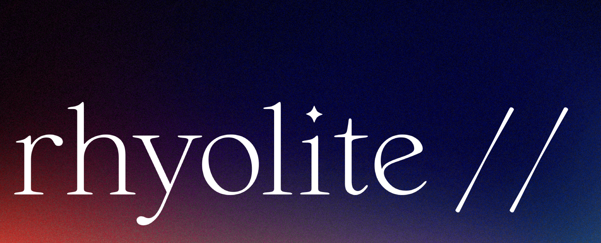
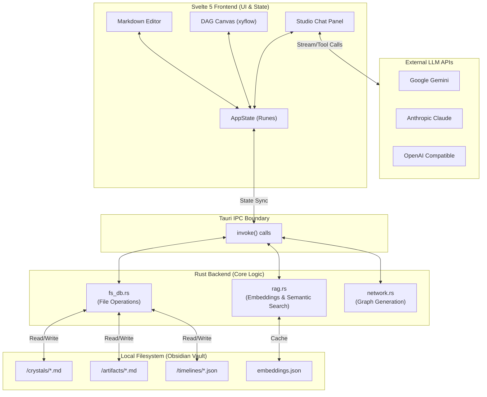
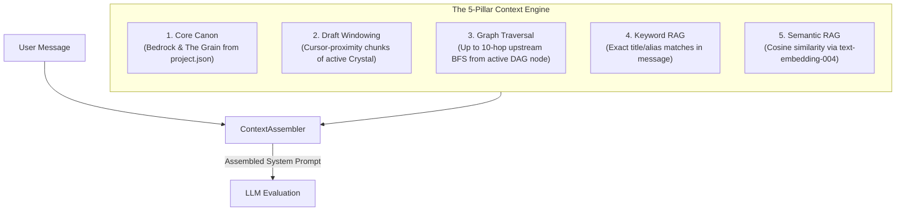
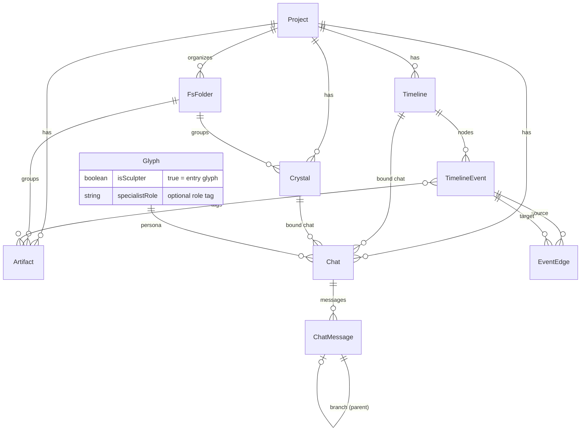

**Private, local, desktop-native workspace for writers, researchers, and worldbuilders powered by multi-provider LLMs.**

[](https://github.com/7368697661/rhyolite)


---

## Welcome to Rhyolite

Rhyolite is a creative environment designed to help you build complex worlds, draft intricate narratives, and conduct deep research. By combining an Obsidian-compatible local filesystem with powerful, agentic AI, Rhyolite acts as a co-pilot that actually understands the rules, characters, and timelines of your specific project.

### The Glossary

The interface uses a stone/crafting theme to reflect the creative process of shaping raw ideas into refined work.

- **Crystals (Documents)**: Your primary writing space (chapters, scenes, drafts).
- **Artifacts (Wiki Entries)**: Your project encyclopedia (characters, locations, lore).
- **Veins (Timelines)**: Visual directed acyclic graphs (DAGs) plotting events and causality.
- **Quarry (Global Map)**: A bird's-eye view of every entity and connection in your project.
- **Studio (Chat)**: The communication panel where you interact with the AI.
- **Sculptors**: The primary AI personas you chat with directly in the Studio.
- **Chisels**: Specialized AI sub-agents that Sculptors can delegate complex tasks to.
- **Bedrock**: The core canon or rules of your world (always known by the AI).
- **The Grain**: The high-level story outline or narrative direction.

---

## Deep Dive: Core Systems

### 1. Writing & Worldbuilding (Crystals & Artifacts)

At its core, Rhyolite is a powerful Markdown editor. It supports live preview, standard formatting, and `**[[wikilinks]]`**. 

Because Rhyolite uses standard Markdown files with YAML frontmatter, **your project is fully compatible with Obsidian**. You can open a Rhyolite project folder directly in Obsidian, and all your links, files, and folders will work perfectly.

**The "Resolve Links" Feature**
If you are drafting a Crystal and write a link to a character that doesn't exist yet (e.g., `[[King Elwin]]`), you can click the **[ Resolve Links ]** button. Rhyolite will spin up a 3-stage AI pipeline (Researcher -> Writer -> Auditor). The AI will read your draft, infer who "King Elwin" is based on context, and autonomously generate a fully fleshed-out Artifact for him, saving it directly to your filesystem.

### 2. Visualizing Timelines (Veins & Quarry)

Plotting a complex narrative requires more than text. **Veins** are interactive graphs where you can map out events.

- **Nodes**: Represent events. You can assign them "Types" (Event, Lore, Scene) and color-code them.
- **Edges**: Connect nodes to show causality. *Edges automatically inherit the color of their source node*, allowing you to visually trace specific character arcs or plot threads through a complex web.
- **The Quarry**: When you need to see everything, the Quarry provides a physics-based global map of every Crystal, Artifact, and Vein in your project, showing exactly how they interconnect.

### 3. Conversing with the Model (The Studio)

Every Crystal, Artifact, and Vein gets its own dedicated chat session. The Studio operates in three distinct modes:

- **Inspect Mode**: Read-only. Ask the model questions about your world. It reads your current file, fetches relevant lore, and answers you. It cannot change your files.
- **Carve Mode**: The Agent mode. The model is given tools to read, write, create, and delete files. You can ask it to "Create artifacts for all the major factions mentioned in my outline," and it will do the work autonomously. Risky actions (like deleting) always pause for your explicit approval.
- **Blueprint Mode**: The planner. The model generates a checklist of proposed actions. You review the checklist, uncheck anything you don't like, and click Execute.

### 4. AI Personas (Glyphs)

You aren't stuck with a single, generic model. In the **Glyph Registry**, you can create custom personas, selecting the LLM provider (Google, OpenAI, Anthropic), the specific model, temperature, and system instructions.

- **Sculptors**: The personas you select from the dropdown in the Studio.
- **Chisels**: If you uncheck "Sculptor", a Glyph becomes a Chisel. These are specialized workers (e.g., "Continuity Checker", "Deep Researcher"). In Carve mode, a Sculptor can realize a task is too big and autonomously delegate it to a Chisel, or even fan-out the task to multiple Chisels at once.

---

## Potential Use Cases

- **The Novelist**: Keep your lore bible in Artifacts, plot your chapters in Veins, and write in Crystals. When you get stuck, open the Studio in Inspect mode and ask your AI (who has read your whole manuscript) for brainstorming ideas.
- **The TTRPG Game Master**: Build out your campaign setting. Create a "Continuity Checker" Chisel. When your players do something unexpected, use Carve mode to quickly generate new NPCs and locations that fit perfectly within your existing world rules.
- **The Deep Researcher**: Store papers and notes as Crystals. Build a Vein to map out the logical flow of a complex argument or hypothesis, visually tracing how different pieces of evidence support the final conclusion.

---

## Technical Architecture Deep Dive

Rhyolite operates as a desktop-native application utilizing Svelte 5 for a highly reactive frontend, paired with a Tauri (Rust) backend for secure, high-performance local filesystem operations.

### 1. System Architecture & Data Flow

The application is strictly divided into a view layer (Svelte) and a secure local backend (Rust). The LLM interactions happen entirely via API calls to external providers, but all project state is stored locally on your machine.




### 2. The Hybrid RAG Engine (Context Assembly)

When a user sends a message in the Studio, the system does not just send the conversation history. It builds a massive, highly specific context window using five distinct pillars of information retrieved from the local filesystem.




### 3. Agentic Tooling & The "Carve" Loop

In "Carve" mode, the LLM acts as an autonomous agent. The Svelte frontend orchestrates a loop where the LLM evaluates the context, requests tool calls, the frontend executes them via Tauri, and returns the result to the LLM. 

To prevent runaway costs and infinite loops, the system enforces strict guardrails:

- **Outer Loop Limit**: Sculptors are hard-capped at 20 tool iterations per message.
- **Inner Loop Limit**: Delegated Chisels are hard-capped at 8 tool iterations.
- **Risk Assessment**: Destructive tools (like `delete_artifact`) immediately pause the loop and render a confirmation UI in the chat for the user to approve.


### 4. Multi-Agent Delegation Flow

Sculptors can spawn entire sub-agent loops using `delegate_to_specialist` (sequential) or `delegate_fan_out` (parallel). This allows a generalist model (like Claude 3.5 Sonnet) to spin up cheaper, specialized models (like Gemini 2.5 Flash) for bulk work.


### 5. Entity-Relationship Data Model

The structural relationship of the data stored on disk.




---

## Installation & Setup

### Prerequisites

- **Node.js** (v18+)
- **Rust** (via `rustup`, required for Tauri compilation)
- **macOS / Linux / Windows** (Tauri supports all major desktop platforms)

### Setup Instructions

1. **Clone the repository**
  ```bash
   git clone https://github.com/7368697661/rhyolite.git
   cd rhyolite
  ```
2. **Install frontend dependencies**
  ```bash
   npm install
  ```
3. **Environment Configuration**
  Copy the example environment file and add your API keys.
   **Required Variables in `.env`:**
  - `GEMINI_API_KEY`: Required for semantic embeddings (`text-embedding-004`) and default model access.
  - `OPENAI_API_KEY` (Optional): For GPT-4o, etc.
  - `ANTHROPIC_API_KEY` (Optional): For Claude models.
  - `WORKSPACE_DIR` (Optional): Override the default `.workspace/` save location.
4. **Run the Desktop App (Development Mode)**
  This will compile the Rust backend and launch the Tauri desktop window.

---

## Font Credits

The Rhyolite UI relies on several carefully chosen fonts to achieve its distinct aesthetic:

- **[Monaspace Neon](https://monaspace.githubnext.com/)**: Primary UI and Editor font. Created by GitHub Next.
- **[Nightingale](https://deathoftypography.com/nightingale/)**: Used for stylistic headings. Created by Death of Typography.
- **[Assistant](https://fonts.google.com/specimen/Assistant)**: Secondary sans-serif. Available via Google Fonts.
- **[Cormorant Garamond](https://fonts.google.com/specimen/Cormorant+Garamond)** & **[Fraunces](https://fonts.google.com/specimen/Fraunces)**: Used for serif body text and italics in documentation contexts.

---

## License

Copyright (c) 2026 [7368697661](https://github.com/7368697661).

Rhyolite// is licensed under the [Business Source License 1.1](LICENSE). You may use, modify, and share the software for personal, hobby, academic, and other non-production use. **Production Purpose** (monetizing as a service/product, or mandated use inside a for-profit entity for core commercial operations) requires a commercial license. Full terms and the detailed Production Purpose section are in [LICENSE](LICENSE). After the Change Date (2030-03-30), all versions convert to Apache 2.0.