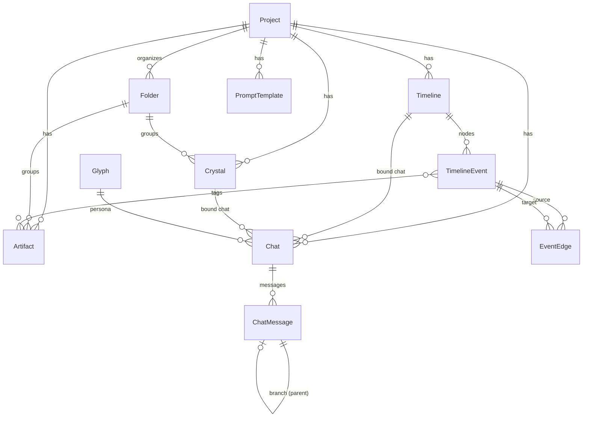

<p align="center">
  <code>&gt;_ RHYOLITE//</code>
</p>

<p align="center">
  <strong>Terminal-grade creative + research environment with multi-provider LLMs, DAG reasoning, and hybrid RAG.</strong>
</p>

<p align="center">
  <a href="https://github.com/7368697661/rhyolite"></a>
  
  
  
  
  
  
</p>

---

## What is Rhyolite//

Rhyolite// is a local-first, keyboard-driven IDE for long-form fiction, worldbuilding, and technical research. It replaces the typical "smart notepad + chatbot" pattern with a high-density terminal interface backed by a **Directed Acyclic Graph (DAG) reasoning engine**, **hybrid RAG pipeline** (keyword + embedding + graph traversal), and **multi-provider LLM streaming** (Gemini, OpenAI-compatible, Anthropic).

Everything runs on your machine. Projects are plain Markdown and JSON files on disk — no database, no cloud sync, fully inspectable.

---

## Architecture Overview

```
┌─────────────────────────────────────────────────────────────┐
│  UI Layer (React 19 + Next.js App Router)                   │
│  ┌──────────┬──────────────────┬──────────────┐             │
│  │ Sidebar  │  Editor / DAG /  │   Comms      │             │
│  │ (Dir)    │  Global Map      │   (Chat)     │             │
│  └──────────┴──────────────────┴──────────────┘             │
├─────────────────────────────────────────────────────────────┤
│  API Layer (Next.js Route Handlers)                         │
│  /api/chat  /api/timeline  /api/search  /api/network  ...   │
├─────────────────────────────────────────────────────────────┤
│  Context Engine                                             │
│  ┌──────────┬──────────┬──────────┬──────────┬────────────┐ │
│  │ Core     │ Keyword  │ Embed    │ Graph    │ Smart      │ │
│  │ Canon    │ RAG      │ RAG      │ Traverse │ Windowing  │ │
│  └──────────┴──────────┴──────────┴──────────┴────────────┘ │
├─────────────────────────────────────────────────────────────┤
│  LLM Providers (Gemini · OpenAI-compat · Anthropic)         │
├─────────────────────────────────────────────────────────────┤
│  Filesystem Persistence (Markdown + JSON, no DB)            │
│  crystals/*.md  artifacts/*.md  timelines/*.json  chats/*   │
└─────────────────────────────────────────────────────────────┘
```

---

## Core Systems

### 1. Terminal Interface

| Pane | Role |
|------|------|
| **Sidebar** (`DIR`) | Project tree: `CRYSTAL_DB` (chapters w/ folders), `ARTIFACTS` (wiki), `TIMELINES` (DAG canvases). Drag-and-drop reordering, per-folder `[EXP]` export. System section at bottom: settings, glyphs, manuscript export. |
| **Editor** (`EDIT`) | Split-pane Markdown editor + live preview. Debounced rendering (dynamic delay by word count). AI diff highlighting on appended content. Inline entity link suggestions with navigate / insert actions. Infill on selections. |
| **Comms** (`COMMS`) | Streaming chat bound to a crystal or timeline. Branch navigation (fork/backtrack). Compact token budget display (`CTX: ~20.6k`, hover for full breakdown). Edit/delete messages. Saved prompt templates (`/`). Safety presets. |
| **Global Network Map** | `d3-force` + `reactflow` physics graph of all entities. Click to preview, open, or explore relationships. |
| **Command Palette** | `Cmd+K` full-text search across crystals, artifacts, and timeline events. Focus trap, ARIA dialog semantics. |

- **Keyboard shortcuts**: `Cmd+K` search, `Cmd+1` focus editor, `Cmd+2` focus comms
- **Inline forms**: All create/rename/delete actions use terminal-styled inline prompts (no browser dialogs)
- **Styling**: Ultraviolet color scheme, Monaspace Neon body font with ligatures, CRT crosshair overlays, `tailwindcss-animate` transitions

### 2. DAG Reasoning Engine

Each **Timeline** is an independent DAG canvas (`reactflow`). Nodes and edges are stored as JSON.

**Node types** (categorical):

| Category | Types |
|----------|-------|
| Narrative | `Event`, `Scene`, `Lore` |
| Technical | `Hypothesis`, `Evidence`, `Conclusion` |

**Key capabilities**:

- **Semantic edges**: Connect nodes via handles, then click the edge to label the relationship (`"Supports"`, `"Contradicts"`, `"Implements"`, etc.). Labels are injected into LLM context as `[Node A] --(Contradicts)--> [Node B]`.
- **Full content passthrough**: Toggle `INJECT FULL CONTENT DOWNSTREAM` on a node to bypass summary truncation — the upstream node's full content is included in all downstream context.
- **Auto-synthesis**: Click `[ AUTO_SYNTHESIZE ]` on any node. The engine BFS-traverses up to 10 hops upstream, collects content/summaries + edge semantics, and prompts the LLM to synthesize a conclusion.
- **Reference nodes**: Drag a crystal or artifact from the sidebar onto the canvas. The new node carries a reference link and injects the source document's content into the graph context.
- **Templates**: Predefined node/edge scaffolds for common patterns (narrative arcs, argument chains, etc.).
- **Grid snapping, backspace delete, double-click to create**.

### 3. Hybrid RAG Pipeline

When a chat message is sent, the context engine assembles a prompt from five sources:

| Source | Method | Scope |
|--------|--------|-------|
| **Core Canon** | Always injected | `loreBible` + `storyOutline` from project settings → system instruction |
| **Keyword RAG** | Title/alias substring matching | Scans recent user messages + active document tail against all artifact titles and aliases |
| **Embedding RAG** | Cosine similarity via `text-embedding-004` | Stored in `embeddings.json` per project; combined with keyword results for hybrid recall |
| **Graph Traversal RAG** | BFS backward from focused DAG node | Depth ≤ 10 hops. Full content for active node, summaries (or full if `passFullContent`) for ancestors, edge semantics included |
| **Smart Context Windowing** | Cursor-position-based chunking | For documents > 800 words: sends first 200 words + ~400 words around cursor + last 200 words instead of full content |

Token budget is computed during assembly and streamed to the client as a `__meta` JSON frame before the first content token.

### 4. Multi-Provider LLM Support

Each **Glyph** (AI persona) specifies provider, model, temperature, max tokens, and system instructions.

| Provider | Config | Notes |
|----------|--------|-------|
| **Gemini** | `GEMINI_API_KEY` | Default. Uses `@google/genai` SDK. Embedding via `text-embedding-004`. |
| **OpenAI-compatible** | `OPENAI_API_KEY` + `OPENAI_BASE_URL` | Any OpenAI-API-compatible endpoint (local models, Together, etc.) |
| **Anthropic** | `ANTHROPIC_API_KEY` | Claude models via Anthropic SDK |

Provider abstraction lives in `src/lib/providers.ts`. Streaming is handled uniformly regardless of backend.

### 5. Filesystem Persistence

No database. Each project is a directory under the workspace root:

```
.workspace/
├── glyphs.json                   # AI personas (workspace-wide)
├── entity-index.json             # O(1) entity→project lookup cache
└── <project-id>/
    ├── project.json              # Name, loreBible, storyOutline
    ├── folders.json              # Folder tree for crystals + artifacts
    ├── crystals/
    │   ├── <id>.md               # YAML frontmatter + Markdown body
    │   └── .history/             # Auto-snapshots on save
    ├── artifacts/
    │   ├── <id>.md
    │   └── .history/
    ├── timelines/
    │   └── <id>.json             # Nodes, edges, positions
    ├── chats/
    │   └── <id>.json             # Messages, branch tree, glyph binding
    └── embeddings.json           # Vector cache for embedding RAG
```

Documents use `gray-matter` for YAML frontmatter (title, folderId, orderIndex, aliases, timestamps) with Markdown body.

---

## Setup

### Prerequisites

- **Node.js** v18+
- **Gemini API Key** (required). Optional: `OPENAI_BASE_URL` + `OPENAI_API_KEY`, `ANTHROPIC_API_KEY`.

### Install

```bash
git clone https://github.com/7368697661/rhyolite.git
cd rhyolite
npm install
cp .env.example .env   # add your GEMINI_API_KEY
npm run dev             # → http://localhost:3000
```

Set `WORKSPACE_DIR` in `.env` to customize where project data lives (defaults to `.workspace/` under repo root).

---

## Usage

### Quick Start

1. Create or select a **project**.
2. Set **Core Canon** (metaphysics, tone, hard rules) and **Story Outline** in Project Settings — these are always-on in the system prompt.
3. Populate **Artifacts** with entities. Titles and aliases drive both keyword and embedding RAG — name things consistently.
4. Write in **Crystals**. Each crystal has its own chat binding. Use `[entity name]` bracket syntax for internal links.
5. Hover entity links for content previews. `Cmd+K` to search everything.

### DAG Workflow

1. Create a **Timeline** under `:: TIMELINES`.
2. Open it — the center pane becomes the DAG canvas.
3. Initialize **Comms** for the timeline (select a glyph, `[ INITIALIZE_UPLINK ]`).
4. Build the graph: double-click to create nodes, connect handles, click edges to label relationships.
5. Drag crystals/artifacts from the sidebar to create reference nodes.
6. **Focus a node** (click it), then prompt in comms. The engine sees the full upstream context chain.
7. Use `[ AUTO_SYNTHESIZE ]` on terminal nodes for automated multi-hop reasoning.
8. `[+ DOC]` appends AI output to the linked crystal.

### Referencing Entities in Chat

There is no `@mention` syntax. The model sees artifacts whose **titles or aliases** appear as substrings in your recent messages + active document tail, plus semantically similar entries via embedding search. Name things consistently or add aliases in artifact metadata.

### Markdown Features

| Syntax | Behavior |
|--------|----------|
| `[Title]` | Resolves to internal crystal/artifact link (navigable, with hover preview) |
| `[[Title]]` | Same, alternative syntax |
| `[Title](<TitleOrId>)` | Explicit link with custom display text |
| `> [!quote] ...` | Renders as styled callout, hides the `[!quote]` marker |

### Global Network Map

Open from the top bar (`[ GLOBAL_NETWORK ]`). Shows all entities as a physics-based graph.

| Edge Color | Relationship |
|------------|-------------|
| **Pink** | Content links (bracket references between documents) |
| **Violet** | Timeline DAG edges |
| **Amber** | Event → Crystal/Artifact references |
| **Teal** | Event → Artifact tag connections |

Click a node to preview. Click empty space to deselect.

---

## Data Model



---

## System Graph

```mermaid
graph TB
  subgraph UI ["UI Layer"]
    direction LR
    SB["ProjectSidebar<br/>File tree · Drag/drop · Export"]
    NAV["WorkspaceClient<br/>Navigation · History · Hotkeys"]
    EDIT["DocumentEditorPane<br/>Editor · Preview · Diff · Entities"]
    WIKI["WikiMarkdown<br/>Links · Callouts · Hover previews"]
    DAG["TimelineCanvas<br/>reactflow DAG · Templates"]
    COMMS["ChatThread<br/>Streaming · Branching · Tokens"]
    MAP["GlobalMapCanvas<br/>d3-force · reactflow"]
    CMD["CommandPalette<br/>Full-text search · Focus trap"]
  end

  subgraph API ["API Layer"]
    direction LR
    NET_API["/api/.../network"]
    TL_API["/api/timeline"]
    NODE_API["/api/timeline/nodes"]
    SYNTH_API["/api/.../synthesize"]
    TPL_API["/api/.../templates"]
    CHAT_API["/api/chat"]
    REGEN_API["/api/chat/regenerate"]
    MSG_API["/api/chats/.../messages"]
    DOC_API["/api/documents"]
    WIKI_API["/api/wiki"]
    SEARCH_API["/api/search"]
    HIST_API["/api/history"]
    ENT_API["/api/entities/suggest"]
    PROMPT_API["/api/prompts"]
    EXPORT_API["/api/.../export"]
  end

  subgraph CTX ["Context Engine"]
    direction LR
    DAGCTX["Graph Traversal<br/>BFS ≤ 10 hops"]
    LEXRAG["Keyword RAG<br/>Title/alias match"]
    EMBRAG["Embedding RAG<br/>text-embedding-004"]
    CANON["Core Canon<br/>loreBible + storyOutline"]
    DRAFT["Smart Windowing<br/>Cursor-based chunks"]
    STREAM["Provider Streaming<br/>Gemini · OpenAI · Anthropic"]
  end

  subgraph FS ["Filesystem"]
    direction LR
    PROJ["project.json · folders.json"]
    CRYS["crystals/*.md + .history/"]
    ARTS["artifacts/*.md + .history/"]
    TLNS["timelines/*.json"]
    CHATS["chats/*.json"]
    GLYPHS["glyphs.json"]
    IDX["entity-index.json"]
    EMBS["embeddings.json"]
  end

  SB -->|navigate| NAV
  NAV --> EDIT
  NAV --> DAG
  NAV --> COMMS
  NAV -->|GLOBAL_NETWORK| MAP
  NAV -->|Cmd+K| CMD

  EDIT --> WIKI
  EDIT -->|suggestions| ENT_API
  DAG -->|focus node| NODE_API
  DAG -->|templates| TPL_API
  MAP --> NET_API
  CMD --> SEARCH_API

  NET_API --> CRYS
  NET_API --> ARTS
  NET_API --> TLNS

  TL_API --> TLNS
  NODE_API --> TLNS
  SYNTH_API --> TLNS
  CHAT_API --> CHATS
  REGEN_API --> CHATS
  MSG_API --> CHATS
  DOC_API --> CRYS
  WIKI_API --> ARTS
  EXPORT_API --> CRYS
  HIST_API --> CRYS
  HIST_API --> ARTS

  NODE_API -->|activeNode| DAGCTX
  DAGCTX --> CHAT_API
  LEXRAG --> CHAT_API
  EMBRAG --> CHAT_API
  CANON --> CHAT_API
  DRAFT --> CHAT_API
  CHAT_API --> STREAM
  SYNTH_API --> STREAM

  COMMS -->|+DOC| DOC_API
  COMMS -->|delete| MSG_API
  COMMS -->|regen| REGEN_API
  COMMS -->|templates| PROMPT_API
  DAG --> TL_API
  DAG -->|synthesize| SYNTH_API
  SB -->|drag crystal/artifact| DAG
```



---

## Tech Stack

| Layer | Technology |
|-------|-----------|
| Framework | Next.js 15 (App Router) + React 19 |
| Language | TypeScript 5.x |
| Styling | Tailwind CSS + `tailwindcss-animate` |
| Canvas | `reactflow` v11, `d3-force` |
| Markdown | `react-markdown` + `remark-gfm` |
| AI | `@google/genai`, OpenAI-compatible REST, `@anthropic-ai/sdk` |
| Persistence | `fs/promises` + `gray-matter` (YAML frontmatter Markdown) |
| Search | Custom full-text scoring + Gemini `text-embedding-004` embeddings |
| Validation | `zod` |
| Fonts | Monaspace Neon (body), Cormorant Garamond, Fraunces (headings) |

---

## License

Copyright (c) 2026 [7368697661](https://github.com/7368697661).

Rhyolite// is licensed under the [Business Source License 1.1](LICENSE). You may use, modify, and share the software for personal, hobby, academic, and other non-production use. **Production Purpose** (monetizing as a service/product, or mandated use inside a for-profit entity for core commercial operations) requires a commercial license. Full terms and the detailed Production Purpose section are in [LICENSE](LICENSE). After the Change Date (2030-03-30), all versions convert to Apache 2.0.
