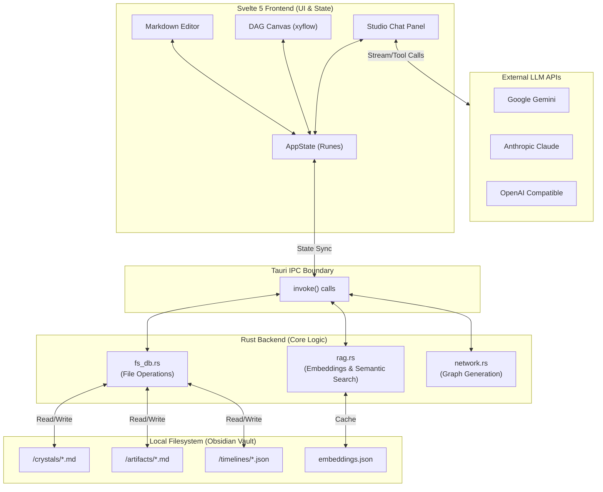
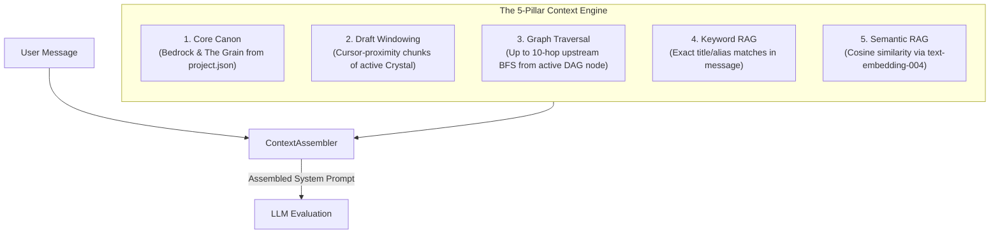
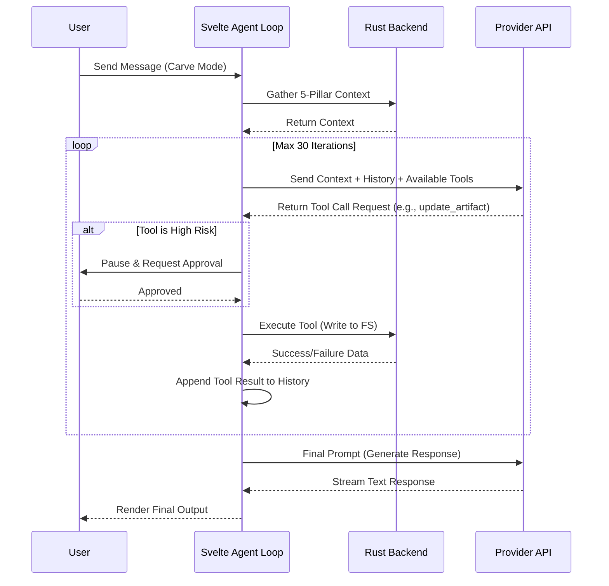
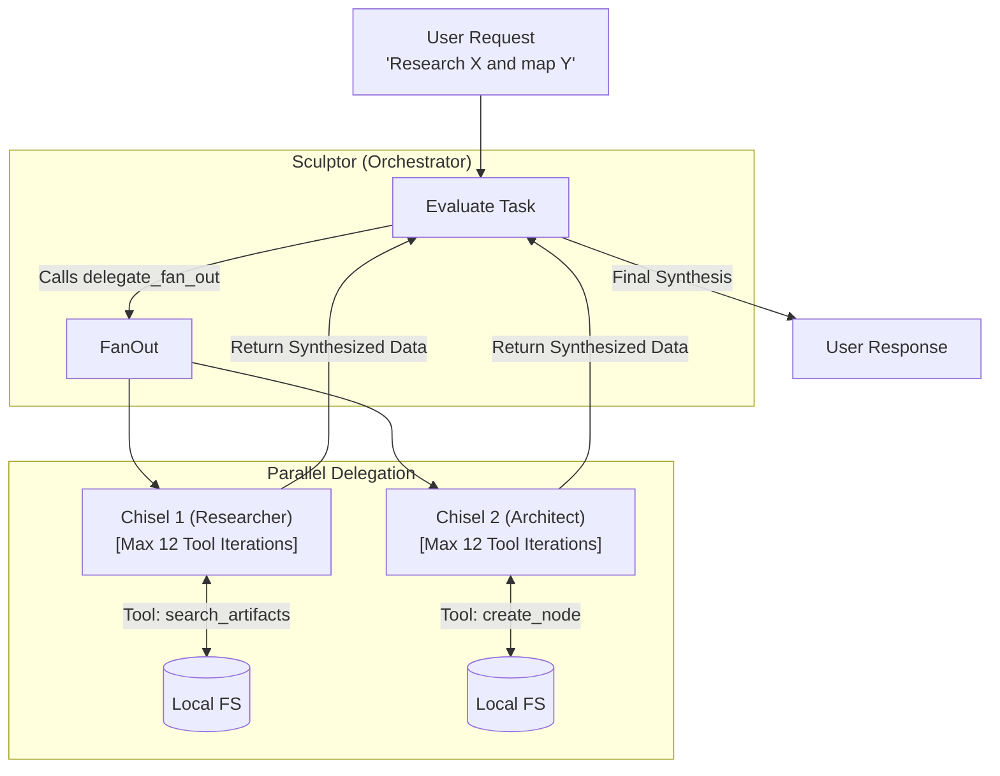
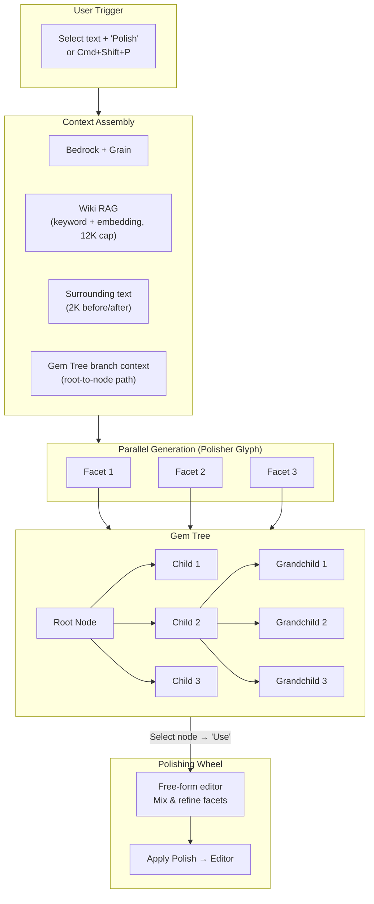
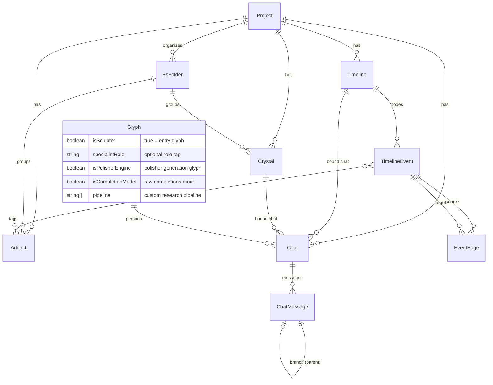

**Private, local, desktop-native workspace for writers, researchers, and worldbuilders powered by multi-provider LLMs.**

[](https://github.com/7368697661/rhyolite)


---

## Welcome to Rhyolite

Rhyolite is a creative environment purpose-built for people who work with complex, interconnected bodies of text: novelists plotting multi-thread narratives, TTRPG game masters maintaining living campaign settings, academics mapping the topology of an argument, and worldbuilders who need a single workspace where every character, faction, timeline, and draft lives together and stays internally consistent. Unlike cloud-hosted writing tools, Rhyolite stores everything on your local filesystem as standard Markdown files with YAML frontmatter and JSON graphs. Nothing leaves your machine unless you explicitly call an LLM API.

By pairing an Obsidian-compatible local vault with a deep, agentic AI layer, Rhyolite acts as a co-pilot that actually understands the rules, characters, and timelines of your specific project. It does not just autocomplete the next sentence; it can read your entire world, answer lore questions, autonomously generate wiki entries for characters you casually name-dropped, and even run multi-agent pipelines where a researcher, a writer, and an auditor collaborate on a single chapter without your intervention.

### The Glossary

The interface uses a stone/crafting theme to reflect the creative process of shaping raw ideas into refined work.

- **Crystal (Document)**: Your primary writing space --- chapters, scenes, drafts, essays. Standard Markdown files stored in `/crystals/`.
- **Artifact (Wiki Entry)**: Your project encyclopedia --- characters, locations, factions, lore. Standard Markdown files stored in `/artifacts/`.
- **Vein (Timeline)**: A visual directed acyclic graph (DAG) plotting events, causality chains, and narrative structure. Stored as JSON in `/timelines/`.
- **Quarry (Global Map)**: A physics-based bird's-eye view of every Crystal, Artifact, and Vein in your project, showing exactly how they interconnect.
- **Studio (Chat)**: The communication panel where you interact with the AI. Each Crystal, Artifact, and Vein gets its own dedicated chat session.
- **Sculptor**: The primary AI persona you select from the dropdown in the Studio. Sculptors can orchestrate the full tool catalog and delegate to Chisels.
- **Chisel**: A specialized AI sub-agent that Sculptors can delegate tasks to. Configured with its own model, temperature, system instruction, and optional specialist role tag.
- **Bedrock**: The core canon or rules of your world --- always injected into the AI's context window so it never contradicts your established lore.
- **The Grain**: The high-level story outline or narrative direction --- always present alongside Bedrock.
- **The Polisher**: Multi-generation refining tool that produces parallel text variations and lets you blend them into a final result.
- **Relief (DAG Template)**: A pre-built timeline structure (e.g., Three-Act Structure, Character Arc) that you can stamp into a Vein as a starting scaffold.
- **Facet**: One of the parallel text generations produced by The Polisher. Typically three Facets are generated simultaneously.
- **Polishing Wheel**: The editor pane inside The Polisher where you mix, edit, and refine Facets into your final text before applying it back to the document.
- **Gem Tree**: The branching tree structure inside The Polisher that tracks every generation, letting you drill into any Facet to spawn further sub-generations.
- **Write Pipeline**: The automated 3-stage writing system (Researcher, Writer, Auditor) that runs Chisels in sequence to produce a complete draft from a single prompt.

---

## Deep Dive: Core Systems

### 1. Writing & Worldbuilding (Crystals & Artifacts)

At its core, Rhyolite is a powerful Markdown editor with three view modes: **Split** (side-by-side editor and live preview), **Write** (editor only), and **Read** (rendered preview only). The editor includes a formatting toolbar with quick-insert buttons for bold, italic, headings, lists, blockquotes, and horizontal rules.

**Entity Linking** is central to the writing experience. Rhyolite supports two link syntaxes:

- **`[[wikilinks]]`** --- the standard double-bracket format used by Obsidian and other knowledge tools. Linking to `[[King Elwin]]` creates a navigable reference to the Artifact with that title.
- **`[Display Text](<Target>)`** --- angle-bracket link syntax that lets you decouple the display text from the target entity name.

As you type, Rhyolite scans your text for entity mentions and offers **link suggestions**, matching against titles and aliases of all Artifacts and Crystals in your project.

**The Dead Link Resolver**

If you draft a Crystal and write a link to a character that does not exist yet (e.g., `[[King Elwin]]`), you can click the **Resolve Links** button. Rhyolite spins up a 3-stage AI pipeline:

1. **Researcher**: Gathers RAG context (embedding-based and keyword) about the missing entity from surrounding text and existing lore. Produces a structured research brief with entity type, known facts, inferred details, connections, and tone notes.
2. **Writer**: Consumes the research brief and any matching wiki template. Generates a full 400--800 word in-universe encyclopedia entry following the template structure, with wikilinks for cross-references.
3. **Auditor**: Reviews the draft against the research brief for factual consistency, template compliance, completeness, and tone. Fixes concrete issues and returns the final article.

Dead links are resolved in parallel batches of 3 for throughput. Progress is streamed to the UI in real time, showing which entity is being researched, written, and audited.

**Obsidian Compatibility**

Because Rhyolite uses standard Markdown files with YAML frontmatter, your project is fully compatible with Obsidian. You can open a Rhyolite project folder directly in Obsidian, and all your links, files, and folders will work perfectly. This also means your data is never locked in --- it is plain text on your filesystem.

**Infill & Rewrite**

Select any text in the editor and use the floating toolbar to trigger an inline rewrite. Provide an instruction (e.g., "make this more foreboding" or "expand this into two paragraphs") and the AI rewrites just the selection, blending seamlessly with the surrounding text. The infill engine has access to your Bedrock, Grain, and all wiki entries for context-aware generation.

**Auto-Save**

Every edit is automatically debounced and persisted to the local filesystem. There is no manual save step.

### 2. Visualizing Timelines (Veins & Quarry)

Plotting a complex narrative requires more than text. **Veins** are interactive directed acyclic graphs (DAGs) where you can map out events, causality, and structure.

- **Nodes**: Represent events, states, turning points, or any entity type you define. Each node has a title, summary, full content, type label, optional color, and can be **tagged** with Artifact references to link timeline events directly to your lore.
- **Edges**: Connect nodes to show causality and sequence. Edges carry optional labels describing the relationship (e.g., "Triggers", "Disrupts", "Results in"). *Edges automatically inherit the color of their source node*, allowing you to visually trace specific character arcs or plot threads through a complex web.
- **Drag-and-Drop**: Drag Crystals and Artifacts from the sidebar directly onto the canvas to create reference nodes.
- **Double-Click to Add**: Double-click any empty area on the canvas to create a new node at that position.
- **Auto-Layout**: The Sugiyama-style layered DAG layout algorithm automatically repositions nodes into a readable left-to-right hierarchy, respecting edge direction.
- **Snap Grid**: Nodes snap to a 16px grid for clean alignment.

**Relief Templates**

Rhyolite ships with 5 built-in Relief templates that you can stamp into any Vein as a starting scaffold:

| Template | Category | Description |
|---|---|---|
| **Three-Act Structure** | Narrative | Setup, Inciting Incident, Conflict, Midpoint, Resolution with key turning points |
| **Character Arc** | Narrative | Status Quo, Catalyst, Struggle, Transformation, New Normal |
| **Research Methodology** | Technical | Hypothesis, Literature Review, Methodology, Data Collection, Analysis, Conclusion |
| **Argument Chain** | Technical | Premises, Supporting Evidence, Counterargument, Rebuttal, Conclusion |
| **Cause-Effect Analysis** | Technical | Root Cause, Contributing Factors, Intermediate Effect, Final Effect |

**The Quarry (Global Network Graph)**

When you need to see everything, the Quarry provides a physics-based global map of every Crystal, Artifact, and Vein event in your project. Nodes are color-coded by type:

- **Amber** (`#f59e0b`): Crystals (documents)
- **Cyan** (`#06b6d4`): Artifacts (wiki entries)
- **Purple** (`#8b5cf6`): Timeline events

The Quarry scans all document and wiki content for `[[wikilinks]]` and bracket links, generating edges wherever one entity references another. Timeline edges, reference links (nodes pointing to documents/wikis), and tag connections are all visualized. The zoom range spans from 0.05x (extreme bird's-eye) to 4x (close detail). The built-in Dagre layout engine arranges the graph in a readable top-to-bottom hierarchy.

### 3. The Studio (AI Chat)

Every Crystal, Artifact, and Vein gets its own dedicated chat session with full branching conversation history. The Studio operates in **five distinct modes**:

- **Inspect Mode** (`ask`): Read-only. Ask the model questions about your world. It reads your current file, fetches relevant lore via RAG, and answers you. It cannot change your files. No tools are provided.
- **Carve Mode** (`agent`): The full agent mode. The model is given the complete tool catalog (22+ tools) to read, write, create, and delete files autonomously. You can ask it to "Create artifacts for all the major factions mentioned in my outline," and it will do the work. Risky actions (like deleting) always pause for your explicit approval. Hard-capped at **30 tool iterations** per message.
- **Blueprint Mode** (`plan`): The planner. The model generates a structured checklist of proposed tool calls, each with a rationale. You review the checklist, uncheck anything you disagree with, and click Execute to run only the approved steps.
- **Write Mode** (`write`): Automatically runs the full **Write Pipeline** --- a 3-stage sequence of Researcher, Writer, and Auditor Chisels. The pipeline discovers tagged Chisels automatically, runs them with role-locked tool permissions, and writes directly to the active document. The Sculptor receives the pipeline output and responds with only a brief summary. A teal progress bar in the UI tracks each pipeline stage. See the dedicated Write Pipeline section below.
- **Research Mode** (`research`): Runs a custom pipeline defined in the Sculptor's glyph configuration. You specify the sequence of specialist role tags (e.g., `researcher, analyst, synthesizer`) and the system auto-delegates to matching Chisels before the Sculptor generates its final response.

**Additional Studio Features:**

- **@Mentions**: Type `@` in the message input to search and pin specific Crystals or Artifacts. Pinned mentions are injected as additional context for the model.
- **File Attachments**: Attach files to messages for the model to reference.
- **Branch/Fork System**: Every message is stored in a tree structure. You can navigate branches, fork from any point in the conversation, and explore alternative continuations. Sibling branches are navigable via left/right arrows on each message.
- **Context Token Estimate**: After each message, the Studio displays a token estimate badge showing the total context size (system prompt + RAG + history), computed at ~4 characters per token.
- **Reasoning Mode**: Toggle extended thinking for supported models. Reasoning tokens stream separately and are displayed in a collapsible section.
- **Sub-Agent Progress**: When Chisels are running (via delegation or pipelines), their progress streams live into the chat with step counts and status messages.

### 4. AI Personas (Glyphs)

You are not stuck with a single, generic model. In the **Glyph Registry**, you can create custom AI personas with full control over every parameter:

**Configuration Options:**

| Field | Description |
|---|---|
| **Provider** | `gemini`, `openai`, or `anthropic` |
| **Model** | Any model ID supported by the provider (e.g., `gemini-2.5-flash`, `gpt-4o`, `claude-3.5-sonnet`) |
| **Temperature** | Creativity dial, 0.0 (deterministic) to 2.0 (maximum randomness) |
| **Output Length** | Maximum output tokens per generation |
| **System Instruction** | The persona's core identity, voice, and behavior rules |
| **Specialist Role** | Role tag for pipeline participation: `researcher`, `writer`, `auditor`, or custom roles |
| **Polisher Engine** | Toggle: marks this Glyph as the generation engine for The Polisher |
| **Completion Engine** | Toggle: uses raw `/completions` endpoints instead of chat (for models like Llama 3.1 405B via OpenRouter, vLLM, or Ollama) |
| **Pipeline** | Comma-separated list of specialist role tags defining a custom research pipeline (e.g., `researcher, analyst, writer`) |

**Sculptors vs. Chisels:**

- **Sculptors** (`isSculpter: true`): The personas you select from the dropdown in the Studio. They orchestrate the full tool catalog and can delegate to Chisels. In Write mode, the Sculptor acts as the final summarizer after the pipeline completes.
- **Chisels** (`isSculpter: false`): Specialized workers. A Chisel becomes a delegation target when you give it a `specialistRole` tag. Examples: a "Continuity Checker" Chisel, a "Deep Researcher" Chisel, a "Writer" Chisel.

**Delegation Mechanisms:**

In Carve mode, a Sculptor can realize a task is too large and autonomously delegate:

- **Sequential** (`delegate_to_specialist`): The Sculptor sends a task to a single Chisel. The Chisel runs its own inner agent loop (up to **12 tool iterations**), then returns a summary to the Sculptor.
- **Parallel** (`delegate_fan_out`): The Sculptor dispatches tasks to multiple Chisels simultaneously. All run in parallel, each with their own inner loop, and results are collected and returned together. This lets a generalist model (like Claude 3.5 Sonnet) spin up cheaper, specialized models (like Gemini 2.5 Flash) for bulk work.

**Write Pipeline Role-Locked Tools:**

When Chisels participate in the Write Pipeline, their available tools are restricted by role to prevent cross-contamination:

| Role | Available Tools |
|---|---|
| **Researcher** | `search_artifacts`, `read_artifact`, `read_draft`, `search_project`, `read_timeline`, `resolve_dead_links` |
| **Writer** | All Researcher tools + `write_draft`, `append_to_draft`, `replace_in_draft`, `create_document` |
| **Auditor** | All Researcher tools + `replace_in_draft`, `read_draft` |

### 5. The Polisher (Multi-Generation Refining)

The Polisher is a dedicated prose refinement tool that generates multiple text variations in parallel and lets you manually blend them into a final result. It operates in a 3-pane layout:

**Left Pane --- Gem Tree:**
A branching tree structure that tracks every generation. Each node in the tree holds one text variant. You can:
- Select any node to view its Facets (children)
- "Drill" into a Facet to make it the new active node, then generate further sub-variations
- Walk the branch context from any node back to the root, accumulating text along the path for the LLM to use as context
- Zoom into subtrees to focus on a particular branch
- The root node represents the original text or cursor position

**Middle Pane --- Facets:**
Three parallel generations stream simultaneously from the Polisher Glyph. Each Facet card shows its text with a "Use" button. Clicking "Use" imports that Facet's text into the Polishing Wheel. Facets stream in real time as the model generates.

**Right Pane --- Polishing Wheel:**
A free-form text editor where you mix, edit, and refine the imported Facet text. When satisfied, click "Apply Polish" to inject the final text back into the document at the original selection or cursor position.

**Two Modes:**

- **Rewrite Mode** (text selected): The Polisher receives the selected text plus surrounding context (2000 chars before and after). Each Facet is a variation of the selected text that fits seamlessly between the surrounding sections.
- **Forward-Generation Mode** (no selection, cursor only): The Polisher receives the trailing 4000 characters before the cursor and generates continuations. Any text currently following the cursor is provided as tone/context reference only.

**Trigger Methods:**
- Select text and click "Polish" in the floating toolbar
- Press `Ctrl+Shift+P` / `Cmd+Shift+P`

**Dedicated Polisher Glyph:**

The Polisher uses whichever Glyph has the "Polisher Engine" toggle enabled. This Glyph's system instruction, model, temperature, and output length are used for all Polisher generations. The system automatically enriches the Polisher Glyph's context with:
- **Bedrock** (lore bible) and **Grain** (story outline) from the project
- **Wiki entries** matched via keyword (title, individual words of 3+ characters, and aliases) and semantic embedding search
- Wiki context is capped at 12K characters, with keyword matches prioritized over embedding matches

**Completion Model Support:**
Enable the "Completion Engine" toggle on the Polisher Glyph to use raw `/completions` endpoints for models that perform better without chat framing (e.g., Llama 3.1 405B via OpenRouter, vLLM, or Ollama).

### 6. The Write Pipeline

The Write Pipeline is an automated 3-stage writing system that transforms a single user prompt into a complete, reviewed draft. Unlike Carve mode (where the Sculptor does all the work), Write mode distributes the labor across specialized Chisels.

**How It Works:**

1. **Discovery**: When you send a message in Write mode, the system auto-discovers Chisels by scanning for Glyphs with `specialistRole` tags matching `researcher`, `writer`, and `auditor`.
2. **Researcher Stage**: The Researcher Chisel receives the user's prompt and runs with read-only tools (`search_artifacts`, `read_artifact`, `read_draft`, `search_project`, `read_timeline`). It gathers relevant lore, context, and reference material, producing a concise brief of key facts, characters, locations, and plot points.
3. **Writer Stage**: The Writer Chisel receives the user's prompt plus all context accumulated from the Researcher. It calls `write_draft` exactly once with the complete content. It has access to write tools but is instructed to produce plain prose paragraphs without markdown blockquote syntax for narrative text.
4. **Auditor Stage**: The Auditor Chisel receives the full accumulated context, reads the draft via `read_draft`, and reviews it for factual consistency, character voice accuracy, plot coherence, adherence to the user's instructions, and formatting issues. It uses `replace_in_draft` to fix specific issues rather than rewriting the entire draft.
5. **Sculptor Summary**: After all pipeline stages complete, the Sculptor's tools are stripped (set to empty) and it is instructed to produce only a 2--4 sentence summary of what was written and any issues the auditor flagged. The Sculptor never repeats or quotes the written content in chat.

**Setup:**

Create three Chisels in the Glyph Registry:
1. A Chisel with `specialistRole` set to `researcher`
2. A Chisel with `specialistRole` set to `writer`
3. A Chisel with `specialistRole` set to `auditor`

Each can use a different model, temperature, and system instruction. The pipeline will find and use them automatically when you select Write mode in the Studio.

**Pipeline Progress UI:**

The Studio displays a teal progress bar showing which pipeline stage is running, with step indicators (e.g., "Step 1/3: ResearcherName (researcher)"). Sub-agent status messages stream in real time, and each stage's tool calls are logged in the chat.

---

## The 5-Pillar Context Engine (RAG)

Every time you send a message in the Studio, the system does not just send the conversation history. It builds a massive, highly specific context window using five distinct pillars of information retrieved from the local filesystem:

1. **Bedrock & The Grain (Core Canon)**
   - The project's `loreBible` and `storyOutline` fields from `project.json`
   - Injected into the system instruction so they are always present and never displaced by other context
   - This is the immutable foundation the AI must never contradict

2. **Conversation History (Branch Chain)**
   - The full message chain from the current branch tip back to the root
   - Includes all user messages and model responses along the selected branch path
   - Branch choices are resolved so forked conversations maintain their distinct thread

3. **Artifact RAG (Keyword + Semantic)**
   - **Keyword matching**: Scans the last 3 user messages and the trailing 4000 characters of the active draft. Matches wiki entry titles, individual title words (3+ characters to avoid noise), and comma-separated aliases against the search corpus.
   - **Semantic matching**: Sends the recent user text to `text-embedding-004` (Google) and retrieves the top 8 similar entries by cosine similarity from the local embedding cache (`embeddings.json`).
   - **Deduplication**: Keyword matches are collected first (higher precision), then embedding matches fill remaining slots without duplicating keyword hits.
   - Matched wiki entries are injected as RAG context text prepended to the last user message.

4. **Vein RAG (Timeline DAG Traversal)**
   - When the user has an active timeline event selected, the system performs a **backward BFS traversal up to 10 hops** from the active node.
   - Collects all ancestor nodes, their content, summaries, and the edge relationships connecting them.
   - Reference nodes (pointing to documents or wikis) have their full content resolved.
   - The subgraph is serialized as a structured `[TIMELINE DAG CONTEXT]` block showing the active node, its ancestors, and their causal chain.

5. **Draft Windowing (Smart Document Chunking)**
   - For documents under 2000 words: the entire content is included.
   - For longer documents: three windows are extracted to stay within token budget:
     - **Opening window**: First 500 words (establishes voice and setting)
     - **Cursor region**: 1500 words centered on the cursor position (most relevant to what the user is currently working on)
     - **Ending window**: Last 500 words (current state of the narrative)
   - Windows are joined with `[...]` markers where text was elided.

---

## Potential Use Cases

- **The Novelist**: Keep your lore bible in Artifacts, plot your chapters in Veins, and write in Crystals. When you get stuck, open the Studio in Inspect mode and ask your AI (who has read your whole manuscript) for brainstorming ideas. Use the Write Pipeline to have a Researcher gather all relevant lore, a Writer produce a first draft of your next chapter, and an Auditor check it against your continuity. Polish the result with The Polisher, generating three variations of any paragraph and blending the best parts in the Polishing Wheel.

- **The TTRPG Game Master**: Build out your campaign setting with Artifacts for every NPC, faction, and location. Create a "Continuity Checker" Chisel. When your players do something unexpected, use Carve mode to quickly generate new NPCs and locations that fit perfectly within your existing world rules. Map out your campaign's branching plot using Veins with the Three-Act Structure Relief template. When a player mentions a name you have not fleshed out yet, use the Dead Link Resolver to auto-generate a fully detailed wiki entry in seconds.

- **The Deep Researcher**: Store papers and notes as Crystals. Build a Vein using the Argument Chain or Research Methodology Relief templates to map out the logical flow of a complex argument or hypothesis, visually tracing how different pieces of evidence support the final conclusion. Use the Quarry to see your entire research corpus as a network graph, revealing hidden connections between papers. Set up a Research pipeline with a custom specialist sequence to systematically gather, analyze, and synthesize information across your entire knowledge base.

---

## Technical Architecture Deep Dive

Rhyolite operates as a desktop-native application utilizing Svelte 5 for a highly reactive frontend, paired with a Tauri (Rust) backend for secure, high-performance local filesystem operations.

### 1. System Architecture & Data Flow

The application is strictly divided into a view layer (Svelte) and a secure local backend (Rust). The LLM interactions happen entirely via API calls to external providers, but all project state is stored locally on your machine.




### 2. The Hybrid RAG Engine (Context Assembly)

When a user sends a message in the Studio, the system does not just send the conversation history. It builds a massive, highly specific context window using five distinct pillars of information retrieved from the local filesystem.

**Keyword Matching Details:**

- Scans the last 3 user messages + trailing 4000 chars of the active draft
- Tokenizes wiki titles into individual words, filtering words with fewer than 3 characters to reduce noise
- Checks full title match, individual word match, and comma-separated alias match against the search corpus
- Keyword hits are collected into a `Set` for O(1) deduplication

**Semantic Matching Details:**

- Embedding model: `text-embedding-004` (Google)
- Retrieves top 8 similar entries by cosine similarity
- Embedding cache stored locally in `embeddings.json` per project
- Embedding retrieval is best-effort: failures are silently caught so the system degrades gracefully




### 3. Agentic Tooling & The "Carve" Loop

In "Carve" mode, the LLM acts as an autonomous agent. The Svelte frontend orchestrates a loop where the LLM evaluates the context, requests tool calls, the frontend executes them via Tauri, and returns the result to the LLM. 

To prevent runaway costs and infinite loops, the system enforces strict guardrails:

- **Outer Loop Limit**: Sculptors are hard-capped at **30 tool iterations** per message.
- **Inner Loop Limit**: Delegated Chisels are hard-capped at **12 tool iterations**.
- **Risk Assessment**: Destructive tools (like `delete_artifact`, `delete_timeline_node`, `delete_edge`, `delete_document`) immediately pause the loop and render a confirmation UI in the chat for the user to approve or reject. Pending confirmations time out after 5 minutes if unanswered.
- **Context Truncation**: Individual tool results are capped at 100,000 characters. Array results are truncated item-by-item to stay within budget. This prevents a single large search result from blowing out the context window.




### 4. Multi-Agent Delegation Flow

Sculptors can spawn entire sub-agent loops using `delegate_to_specialist` (sequential) or `delegate_fan_out` (parallel). This allows a generalist model (like Claude 3.5 Sonnet) to spin up cheaper, specialized models (like Gemini 2.5 Flash) for bulk work.




### 5. Write Pipeline Flow

The Write Pipeline automates the full researcher-writer-auditor workflow. It runs before the Sculptor's final generation, injecting cumulative context at each stage.

```mermaid
sequenceDiagram
    participant User
    participant Studio as Studio (Write Mode)
    participant Discover as Chisel Discovery
    participant R as Researcher Chisel
    participant W as Writer Chisel
    participant A as Auditor Chisel
    participant S as Sculptor
    participant FS as Local Filesystem

    User->>Studio: Send message
    Studio->>Discover: Find chisels by specialistRole tags
    Discover-->>Studio: researcher, writer, auditor glyphs

    rect rgb(20, 60, 60)
        Note over R,FS: Stage 1 — Research (read-only tools)
        Studio->>R: User prompt + RAG context
        R->>FS: search_artifacts, read_artifact, read_draft
        FS-->>R: Results
        R-->>Studio: Research brief
    end

    rect rgb(20, 60, 60)
        Note over W,FS: Stage 2 — Write (write tools)
        Studio->>W: User prompt + research brief
        W->>FS: write_draft (full content, single call)
        FS-->>W: Success
        W-->>Studio: Writer summary
    end

    rect rgb(20, 60, 60)
        Note over A,FS: Stage 3 — Audit (targeted fixes)
        Studio->>A: User prompt + all prior context
        A->>FS: read_draft, replace_in_draft
        FS-->>A: Fixed content
        A-->>Studio: Audit report
    end

    Studio->>S: Pipeline results (tools stripped)
    S-->>User: Brief summary only (no content in chat)
```




### 6. The Polisher Architecture

The Polisher generates parallel text variations using a dedicated Glyph, organizes them in a branching tree, and lets the user blend results before applying them back to the editor.




### 7. Entity-Relationship Data Model

The structural relationship of the data stored on disk.




### 8. Complete Tool Catalog

All tools available to the agent loop. Risk level determines whether the tool executes immediately or pauses for user confirmation.

| Tool | Risk | Description |
|---|---|---|
| `search_artifacts` | safe | Search wiki entries and documents by keyword and semantic similarity. Returns titles, IDs, and short snippets. Uses both token-based keyword matching and embedding-based RAG. |
| `read_artifact` | safe | Read the full content of a wiki/artifact entry by title or ID. Supports lookup by title, alias, or direct ID. |
| `create_artifact` | normal | Create a new wiki/artifact entry with title, content, and optional comma-separated aliases. |
| `update_artifact` | normal | Update an existing wiki/artifact entry. Supports partial updates (provide only changed fields). |
| `delete_artifact` | **risky** | Permanently delete a wiki/artifact entry. Requires user confirmation. |
| `create_document` | normal | Create a new document (Crystal) in the project with optional initial content and folder placement. |
| `delete_document` | **risky** | Delete a document (Crystal) from the project. Requires user confirmation. |
| `move_file` | normal | Move a document or wiki entry to a different folder within the project. |
| `read_timeline` | safe | Read the full timeline graph (events and edges) for the active or specified timeline. |
| `create_timeline_node` | normal | Add a new event node to the active timeline with title, summary, content, and type. |
| `update_timeline_node` | normal | Update an existing timeline node. Supports partial updates and tag assignment. |
| `delete_timeline_node` | **risky** | Permanently delete a timeline node and all edges connected to it. Requires user confirmation. |
| `create_edge` | normal | Create a directed edge between two timeline nodes with an optional label. Triggers auto-layout. |
| `delete_edge` | **risky** | Delete an edge from the timeline graph. Requires user confirmation. |
| `auto_layout_dag` | safe | Automatically reposition all nodes using a layered Sugiyama-style DAG layout. |
| `read_draft` | safe | Read the current content of the active document/Crystal. |
| `append_to_draft` | normal | Append text to the end of the active document/Crystal. |
| `write_draft` | normal | Overwrite the entire content of the active document/Crystal. |
| `replace_in_draft` | normal | Find and replace a section of text in the active document. Supports exact match with optional replace-all. |
| `search_project` | safe | Full-text keyword + semantic search across all entities (documents, artifacts, timelines, events). |
| `resolve_dead_links` | normal | Find `[[wikilinks]]` in a document that do not point to existing artifacts, then run the 3-stage pipeline to create full wiki entries for each. Supports dry-run mode. |
| `delegate_to_specialist` | normal | Delegate a task to a single Chisel sub-agent. The Chisel runs autonomously (max 12 iterations) and returns a summary. |
| `delegate_fan_out` | normal | Run multiple Chisel sub-agents in parallel, each with its own task. Results are collected and returned together. |
| `propose_plan` | safe | *(Blueprint mode only)* Propose a structured plan of tool calls for the user to review before execution. |

---

## Installation & Setup

### Prerequisites

- **Node.js** (v18+)
- **Rust** (via `rustup`, required for Tauri compilation)
- **macOS / Linux / Windows** (Tauri supports all major desktop platforms)

### Setup Instructions

1. **Clone the repository**
  ```bash
   git clone https://github.com/7368697661/rhyolite.git
   cd rhyolite
  ```
2. **Install frontend dependencies**
  ```bash
   npm install
  ```
3. **Environment Configuration**
  Copy the example environment file and add your API keys.
   **Required Variables in `.env`:**
  - `GEMINI_API_KEY`: Required for semantic embeddings (`text-embedding-004`) and default model access.
  - `OPENAI_API_KEY` (Optional): For GPT-4o, etc.
  - `ANTHROPIC_API_KEY` (Optional): For Claude models.
  - `WORKSPACE_DIR` (Optional): Override the default `.workspace/` save location.
4. **Run the Desktop App (Development Mode)**
  This will compile the Rust backend and launch the Tauri desktop window.
  ```bash
   npm run tauri dev
  ```

---

## Font Credits

The Rhyolite UI relies on several carefully chosen fonts to achieve its distinct aesthetic:

- **[Monaspace Neon](https://monaspace.githubnext.com/)**: Primary UI and Editor font. Created by GitHub Next.
- **[Nightingale](https://deathoftypography.com/nightingale/)**: Used for stylistic headings. Created by Death of Typography.
- **[Assistant](https://fonts.google.com/specimen/Assistant)**: Secondary sans-serif. Available via Google Fonts.
- **[Cormorant Garamond](https://fonts.google.com/specimen/Cormorant+Garamond)** & **[Fraunces](https://fonts.google.com/specimen/Fraunces)**: Used for serif body text and italics in documentation contexts.

---

## License

Copyright (c) 2026 [7368697661](https://github.com/7368697661).

Rhyolite// is licensed under the [Business Source License 1.1](LICENSE). You may use, modify, and share the software for personal, hobby, academic, and other non-production use. **Production Purpose** (monetizing as a service/product, or mandated use inside a for-profit entity for core commercial operations) requires a commercial license. Full terms and the detailed Production Purpose section are in [LICENSE](LICENSE). After the Change Date (2030-03-30), all versions convert to Apache 2.0.
