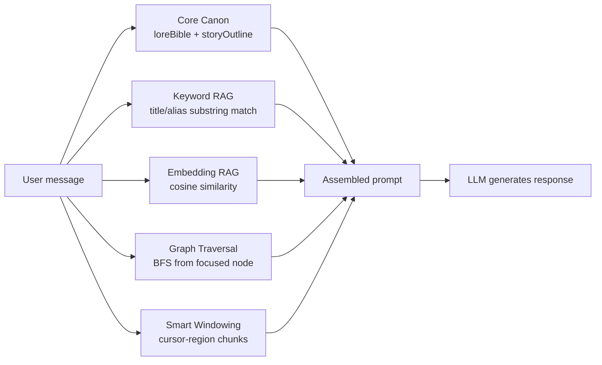
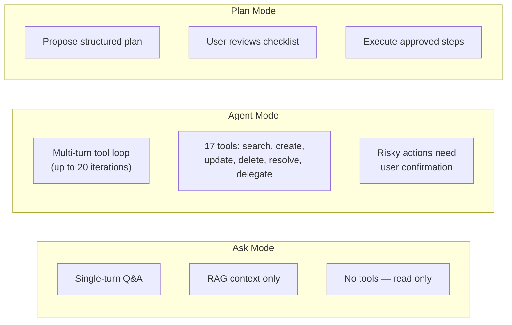
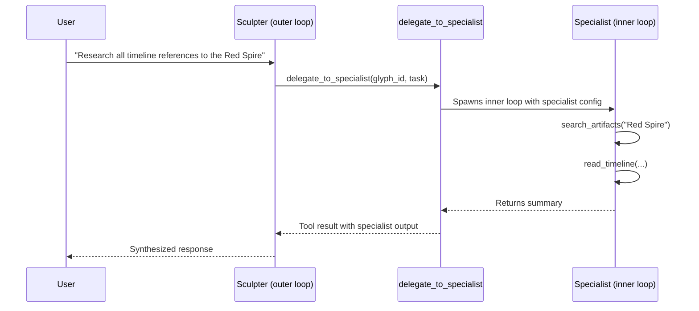
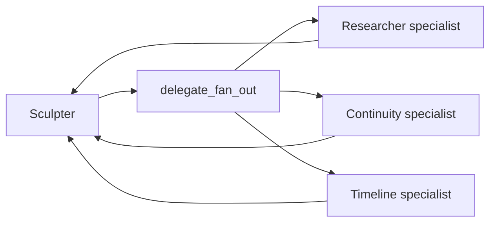
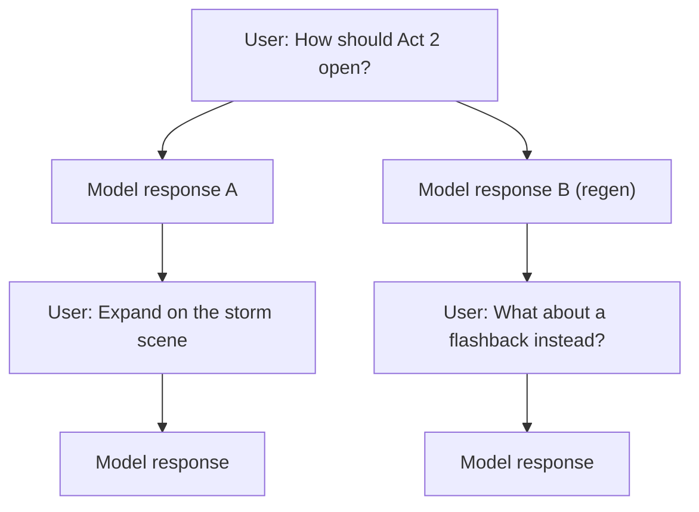
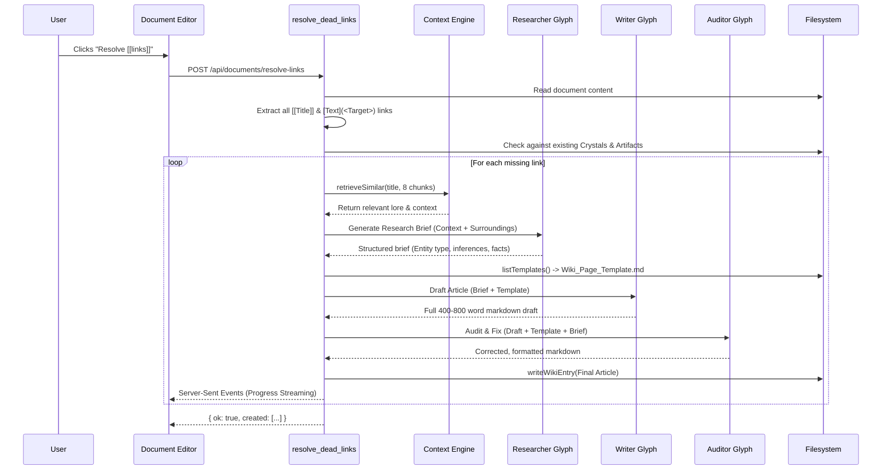
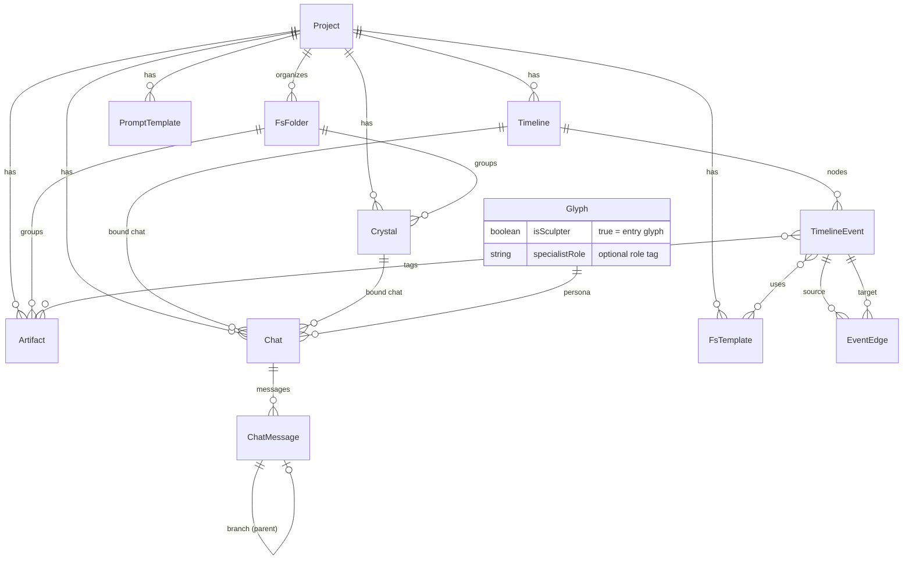

<p align="center">
  <strong>Terminal-inspired creative + research environment with multi-provider LLMs, DAG reasoning, and hybrid RAG.</strong>
</p>

<p align="center">
  <a href="https://github.com/7368697661/rhyolite"></a>
  
  
  
  
  
  
</p>

---

## Quick Start

1. **Clone and install**
   ```bash
   git clone https://github.com/7368697661/rhyolite.git
   cd rhyolite && npm install
   ```
2. **Set up API keys** — copy `.env.example` to `.env` and add at minimum a `GEMINI_API_KEY`. Optionally add `OPENAI_API_KEY` + `OPENAI_BASE_URL` and/or `ANTHROPIC_API_KEY` for multi-provider support.
3. **Start the dev server**
   ```bash
   npm run dev   # → http://localhost:3000
   ```
4. **Open the workspace** — you'll see a welcome screen with an option to create an example project (recommended for first-timers).
5. **Create a project**, set your Core Canon and Story Outline in project settings, then start writing in Crystals.
6. **Try different chat modes** — switch between Ask (questions), Agent (AI tools), and Plan (review-then-execute) in the comms header.
7. **Configure glyphs** — visit the Glyph Registry page to create AI personas, including specialist sub-agents for delegation.
8. **Press `⌘⇧/`** to open the in-app documentation for a full feature reference.

---

## Core Concepts

### Crystals (Documents)

Your primary writing documents — chapters, scenes, drafts. They live in the sidebar under your project and support markdown with live preview, entity linking, and inline AI infill. When a crystal is active, the AI chat automatically includes it as context.

### Artifacts (Wiki Entries)

Your project encyclopedia — characters, locations, factions, items. Each artifact can have aliases so the AI recognizes different names. The retrieval system matches artifacts by title, alias, and semantic similarity, then injects them into the AI's context window.

### Timelines (DAG Canvas)

Visual directed acyclic graphs for plotting stories or argument chains. Nodes represent events or plot points, edges represent relationships. Click a node to focus the AI's context on that node's upstream dependency chain. Use auto-synthesis to generate conclusions from multi-hop graph traversal.

### Comms (Chat)

Each crystal or timeline gets its own AI chat session bound to a glyph (AI persona). Chat supports three modes (Ask, Agent, Plan), branching conversations, file attachments, and prompt templates. The context engine assembles five RAG sources per message.

### Glyphs (AI Personas)

Configurable profiles that control model, provider, temperature, system prompt, and token limits. Glyphs come in two flavors:

- **Sculpters** — entry-point personas shown in the comms picker. They run top-level sessions and can delegate to specialists.
- **Specialists** — sub-agent templates not shown in the picker. A Sculpter can invoke them via `delegate_to_specialist` or `delegate_fan_out` tools in Agent mode. Define them precisely for tasks like research, continuity checking, or timeline management.

---

## How It Works

### Architecture

The following diagram provides a holistic view of the entire Rhyolite system. It maps out how the 3-pane user interface connects to the API orchestration layer, how the 5-pillar context engine retrieves data from the local Obsidian-compatible vault, and how orchestrating Sculpter agents use 17 sandboxed tools or delegate to Specialist sub-agents to mutate that state.

```mermaid
flowchart TD
    subgraph UI [1. Interface & View Layer]
        direction TB
        Editor["Markdown Editor<br/>(Live Preview, Inline Infill, Wikilinks)"]
        Comms["Comms Chat Panel<br/>(Ask / Agent / Plan Modes, Branch/Fork History)"]
        Sidebar["Project Workspace<br/>(Folder D&D, Native OS Mapping)"]
        Canvas["Interactive Canvas<br/>(reactflow DAG, d3-force Global Map)"]
        CmdPalette["Command Palette<br/>(⌘K Full-Text Search)"]
    end

    subgraph Logic [2. API & Orchestration Layer]
        direction LR
        Router["Next.js API Routes"]
        subgraph DeadLink ["3-Stage Dead Link Pipeline"]
            direction LR
            DL_Res["1. Researcher<br/>(Builds Brief)"]
            DL_Wri["2. Writer<br/>(Fills Template)"]
            DL_Aud["3. Auditor<br/>(Fixes & Formats)"]
            DL_Res --> DL_Wri --> DL_Aud
        end
        DAGSynth["DAG Auto-Synthesis<br/>(Upstream causality evaluation)"]
    end

    subgraph Context [3. Hybrid RAG Engine (5-Pillar Context)]
        direction TB
        C_Assembler(("Context Assembler"))
        C_Canon["1. Core Canon<br/>(Lore Bible + Story Outline)"]
        C_Window["2. Smart Windowing<br/>(Cursor proximity chunks)"]
        C_Graph["3. DAG Traversal<br/>(Up to 10-hop BFS causality)"]
        C_Key["4. Keyword RAG<br/>(Title & Alias substring match)"]
        C_Embed["5. Semantic RAG<br/>(text-embedding-004 cosine sim)"]
        
        C_Canon & C_Window & C_Graph & C_Key & C_Embed --> C_Assembler
    end

    subgraph Agents [4. Multi-Agent Engine]
        direction TB
        Sculpter["Sculpter Glyph (Orchestrator)<br/>Config: Provider, Model, Temp, Tokens"]
        
        subgraph Delegation [Specialist Sub-Agents (Inner Loop)]
            direction LR
            DelRouter{"delegate_to_specialist<br/>delegate_fan_out"}
            SpRes["Researcher"]
            SpCont["Continuity"]
            SpTime["Timeline Builder"]
            SpCustom["Custom Specialists"]
            
            DelRouter --> SpRes & SpCont & SpTime & SpCustom
        end
        
        Sculpter -->|"Delegates Complex/Parallel Tasks"| DelRouter
        SpRes & SpCont & SpTime & SpCustom -->|"Return Synthesis"| Sculpter
    end

    subgraph Tooling [5. Tool Execution Sandbox (17 Tools)]
        direction TB
        T_Risk["Risk Assessment Guardrails<br/>(Risky Actions Trigger Inline UI Confirms)"]
        T_Read["Read:<br/>search_artifacts, read_artifact,<br/>read_timeline, read_draft,<br/>search_project"]
        T_Write["Write:<br/>create_artifact, update_artifact,<br/>delete_artifact, append_to_draft"]
        T_Graph["Graph:<br/>create_timeline_node, update_timeline_node,<br/>delete_timeline_node, create_edge,<br/>delete_edge, auto_layout_dag"]
        T_Agent["Agentic:<br/>resolve_dead_links, delegate_to_specialist,<br/>delegate_fan_out"]
        
        T_Risk --> T_Read & T_Write & T_Graph & T_Agent
    end

    subgraph Storage [6. Filesystem (Obsidian Compatible Vault)]
        direction LR
        FS_Md["Markdown Entities<br/>(crystals/*.md, artifacts/*.md)"]
        FS_Json["Structured State<br/>(timelines/*.json, chats/*.json, glyphs.json)"]
        FS_Meta["Project Meta<br/>(_templates/*.md, embeddings.json, known-projects.json)"]
    end

    subgraph LLM [7. External LLM Brains]
        direction LR
        Gemini["Google Gemini"]
        Anthropic["Anthropic Claude"]
        OpenAI["OpenAI Compatible"]
    end

    %% Routing
    UI -->|"User Prompt"| Router
    Editor -->|"Resolve Dead Links"| DeadLink
    Canvas -->|"Auto-Synthesize"| DAGSynth
    
    Router -->|"Fetch Context"| Context
    C_Assembler -->|"Context Injection"| Sculpter
    
    Sculpter -->|"Autonomous Loop (Max 20)"| LLM
    Delegation -->|"Nested Autonomous Loop (Max 8)"| LLM
    DeadLink -->|"Uses Glyphs"| Delegation
    DAGSynth -->|"Uses Templates"| FS_Meta
    
    LLM -->|"Triggers Tool Calls"| Tooling
    Tooling -->|"Reads/Mutates State"| Storage
    Storage -.->|"Live UI Reload"| UI
```

### RAG Context Assembly

Every chat message triggers a five-source context assembly pipeline. This is what makes the AI aware of your world, your draft, and your narrative structure — without you needing to manually @-mention anything.



### Chat Modes

Three modes control how the AI interacts with your project, from read-only questions to full autonomous tool use.



### Sculpter → Specialist Delegation

In Agent mode, a Sculpter glyph can delegate tasks to specialist sub-agents. Each specialist uses its own model, system prompt, and configuration. The inner loop runs autonomously with tool access, then returns results to the orchestrating Sculpter.



For parallel work, `delegate_fan_out` runs multiple specialists concurrently:



### Branching Chat

Every user message can have multiple AI responses. Navigate between branches, regenerate, or fork to explore different directions. The full message tree is persisted to disk.



---

## Obsidian Compatibility

Rhyolite stores crystals and artifacts as human-readable Markdown files with YAML frontmatter. This means you can open any Rhyolite project as an Obsidian vault (or vice versa).

### What works

- **Title-based filenames** — files are named `My Chapter.md` instead of `abc123.md`, so they're browsable in any file manager or Obsidian
- **`[[Wikilinks]]`** — double-bracket links (`[[Character Name]]`, `[[Title|display text]]`) are rendered as clickable entity links in both apps
- **YAML frontmatter** — Rhyolite stores its internal `id` in the frontmatter, which Obsidian displays in its Properties view
- **`.rhyolite/` metadata** — project config lives in a dot-directory that Obsidian ignores

### Single-project mode

Set `PROJECT_DIR=/path/to/your/vault` in `.env` and Rhyolite operates directly inside that folder — no multi-project nesting. Perfect for pointing at an existing Obsidian vault.

### Open Folder

From the project dropdown, choose **Open Folder...** to open a native OS folder picker. Rhyolite will register the folder directly in `known-projects.json` without using symlinks or moving files. Folder structures inside `crystals/` and `artifacts/` are dynamically scanned and map 1:1 to the OS filesystem, allowing true bidirectional sync with apps like Obsidian.

### Templates (`_templates/`)

If your project contains a `_templates/` folder (standard in Obsidian), Rhyolite automatically detects and loads those markdown templates. 
- **Dead Link Resolver**: Automatically prioritizes a template named `Wiki_Page_Template.md` to structure generated artifacts.
- **DAG Canvas**: When auto-synthesizing a node, you can select an available template from a dropdown to structure the AI's output.

### Dead Link Resolver

Click **Resolve [[links]]** in the document editor toolbar to scan the current crystal for `[[wikilinks]]` and Markdown links (`[display](<Target>)`) that don't have matching artifacts. Rhyolite runs a 3-stage specialist AI pipeline (Researcher → Writer → Auditor) with live streaming progress to create fully-fleshed, template-compliant articles using RAG context. This is also available as the `resolve_dead_links` tool in Agent mode.



---

## Example Workflows

### Agent Mode: Expand a Timeline from an Outline

1. Set chat to **Agent** mode.
2. Prompt: *"Read the story outline and create timeline nodes for each major event in Act 1."*
3. The AI calls `search_project` to find the outline, then `create_timeline_node` for each event, and `create_edge` to connect them in sequence.
4. Review the result in the DAG canvas.

### Plan Mode: Batch Artifact Updates

1. Set chat to **Plan** mode.
2. Prompt: *"Update all character artifacts to include their faction affiliation."*
3. The AI proposes a plan: `search_artifacts` → `update_artifact` for each character.
4. Review the checklist, uncheck any you want to skip, then execute.

### Sculpter + Specialist: Chapter Continuity Pass

1. Create a **specialist glyph** named "Continuity Checker" with a system prompt focused on finding inconsistencies against lore.
2. In Agent mode with a Sculpter, prompt: *"Delegate to the continuity checker to review Chapter 3 against the lore bible."*
3. The Sculpter calls `delegate_to_specialist` → the specialist reads the draft and artifacts, returns findings → the Sculpter synthesizes a report.

### Resolve Dead Links After Drafting

1. Write a crystal with `[[wikilinks]]` to characters, locations, or concepts that don't exist yet.
2. Click **Resolve [[links]]** in the editor toolbar.
3. Rhyolite scans the document, identifies dead links, gathers RAG context for each, and creates stub artifacts.
4. Edit the generated stubs to flesh them out.

### Parallel Research with Fan-Out

1. Create specialists for "Character Research" and "Location Research."
2. Prompt: *"Fan out research: have the character specialist gather info on the protagonist, and the location specialist map all scenes set in the Undercity."*
3. Both specialists run concurrently, each searching artifacts and timelines. Results return to the Sculpter for a combined summary.

---

## Configuration

### Environment Variables

| Variable | Required | Description |
|----------|----------|-------------|
| `GEMINI_API_KEY` | Yes | Google Gemini API key (default provider) |
| `OPENAI_API_KEY` | No | OpenAI or compatible endpoint API key |
| `OPENAI_BASE_URL` | No | Base URL for OpenAI-compatible APIs (local models, Together, etc.) |
| `ANTHROPIC_API_KEY` | No | Anthropic Claude API key |
| `WORKSPACE_DIR` | No | Custom workspace directory (defaults to `.workspace/`) |
| `PROJECT_DIR` | No | Single-project mode — point directly at a folder (e.g. an Obsidian vault) |

### Glyph Configuration (`glyphs.json`)

| Field | Type | Description |
|-------|------|-------------|
| `id` | string | Unique glyph identifier |
| `name` | string | Display name |
| `systemInstruction` | string | Base system prompt |
| `provider` | `"gemini"` \| `"openai"` \| `"anthropic"` | LLM provider |
| `model` | string | Model name (e.g. `gemini-2.5-flash`) |
| `temperature` | number | Creativity (0–2) |
| `maxOutputTokens` | number | Max response length |
| `isSculpter` | boolean? | `true` (default) = shown in comms, `false` = specialist only |
| `specialistRole` | string? | Optional role label (e.g. `researcher`, `continuity`) |

---

## Terminal Interface

| Pane | Role |
|------|------|
| **Sidebar** (`DIR`) | Project tree: crystals, artifacts, timelines. Drag-and-drop reordering, per-folder export. |
| **Editor** (`EDIT`) | Split-pane markdown editor with live preview, AI diff highlights, entity links, and inline infill. |
| **Comms** (`COMMS`) | Streaming chat with mode switching, branch navigation, token budget display, and prompt templates. |
| **DAG Canvas** | `reactflow` graph canvas with typed nodes, semantic edges, auto-synthesis, and reference nodes. |
| **Global Network** | `d3-force` physics graph of all entities and relationships. |
| **Command Palette** | `⌘K` full-text search across all project entities. |

---

## Data Model



---

## Filesystem Layout

```
.workspace/                         
├── glyphs.json                     # AI personas (workspace-wide)
├── known-projects.json             # Registry of external folder paths
└── <project-id>/                   # Can live anywhere on disk
    ├── .rhyolite/
    │   └── project.json            # Name, loreBible, storyOutline
    ├── _templates/                 # (Optional) Markdown templates
    ├── crystals/
    │   ├── Subfolder/              # Subdirectories map natively to Rhyolite Folders
    │   │   └── My Chapter.md       # Title-based filename, ID in YAML frontmatter
    │   └── .history/               # Auto-snapshots on save
    ├── artifacts/
    │   ├── The Red Spire.md        # [[wikilinks]] work in both Rhyolite + Obsidian
    │   └── .history/
    ├── timelines/
    │   └── <id>.json               # Nodes, edges, positions
    ├── chats/
    │   └── <id>.json               # Messages, branch tree, glyph binding
    └── embeddings.json             # Vector cache for embedding RAG
```

Files are fully compatible with Obsidian vaults — `.md` files use title-based filenames and store IDs in YAML frontmatter. Use `[[wikilinks]]` or `[Text](<Link>)` to cross-reference between crystals and artifacts. Folders map directly to the OS filesystem, replacing the old `folders.json` approach.

---

## Tech Stack

| Layer | Technology |
|-------|-----------|
| Framework | Next.js 15 (App Router) + React 19 |
| Language | TypeScript 5.x |
| Styling | Tailwind CSS + custom keyframe animations |
| Canvas | `reactflow` v11, `d3-force` |
| Markdown | `react-markdown` + `remark-gfm` |
| AI | `@google/genai`, OpenAI-compatible REST, `@anthropic-ai/sdk` |
| Persistence | `fs/promises` + `gray-matter` (YAML frontmatter Markdown) |
| Search | Token-based keyword matching + Gemini `text-embedding-004` embedding RAG (used in chat context AND agent tools) |
| Validation | `zod` |
| Fonts | Monaspace Neon (body), Cormorant Garamond (fallback), Fraunces (italics), Nightingale (headings) |

---

## Keyboard Shortcuts

| Shortcut | Action |
|----------|--------|
| `⌘K` / `Ctrl+K` | Command palette (search everything) |
| `⌘1` / `Ctrl+1` | Focus editor pane |
| `⌘2` / `Ctrl+2` | Focus chat input |
| `⌘⇧/` / `Ctrl+Shift+/` | Open documentation |
| `Enter` | Send chat message |
| `Shift+Enter` | New line in chat |

---

## License

Copyright (c) 2026 [7368697661](https://github.com/7368697661).

Rhyolite// is licensed under the [Business Source License 1.1](LICENSE). You may use, modify, and share the software for personal, hobby, academic, and other non-production use. **Production Purpose** (monetizing as a service/product, or mandated use inside a for-profit entity for core commercial operations) requires a commercial license. Full terms and the detailed Production Purpose section are in [LICENSE](LICENSE). After the Change Date (2030-03-30), all versions convert to Apache 2.0.
