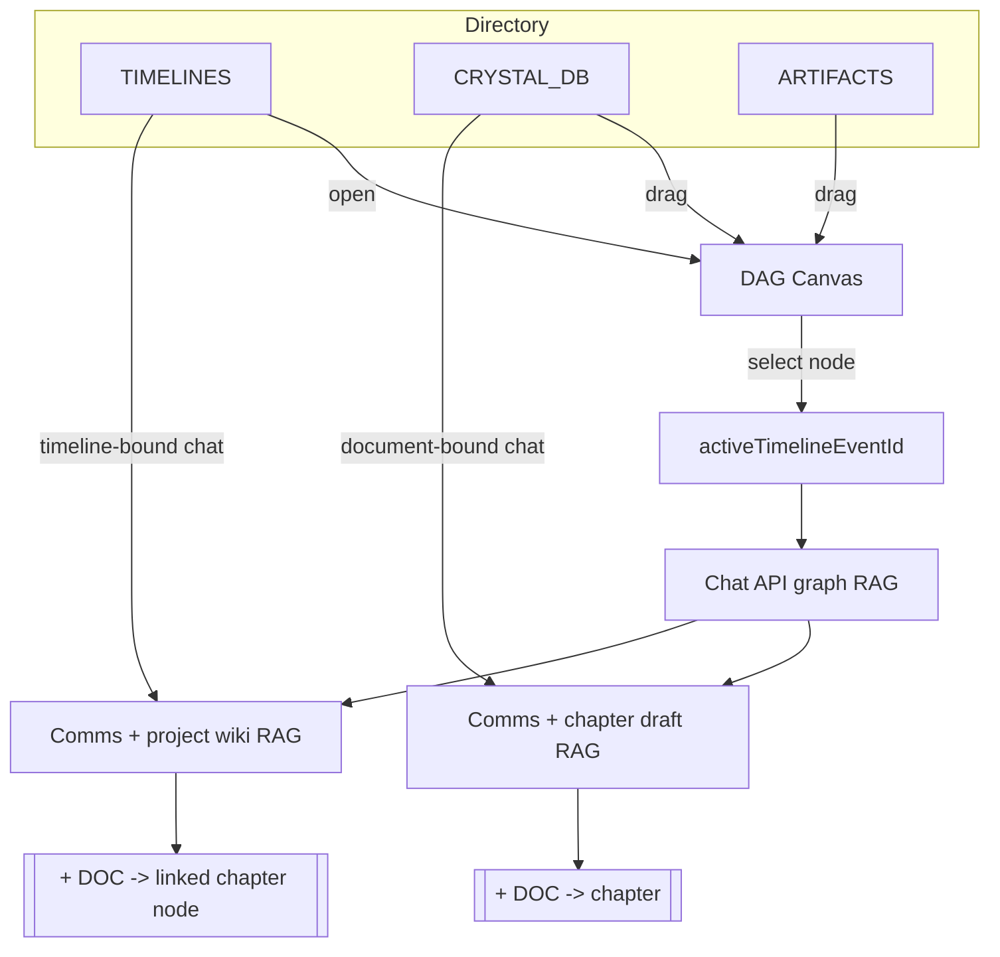
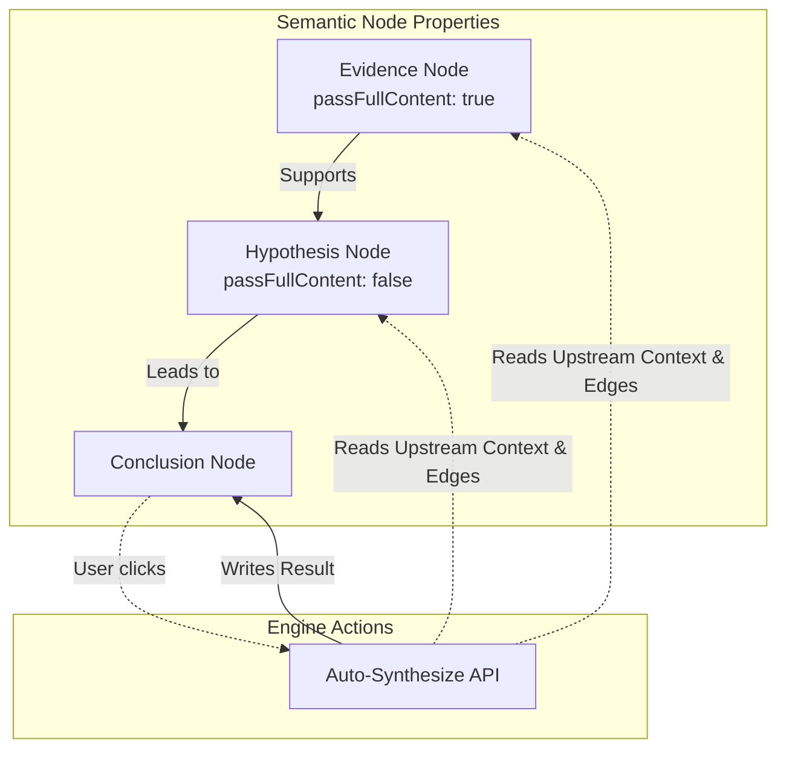
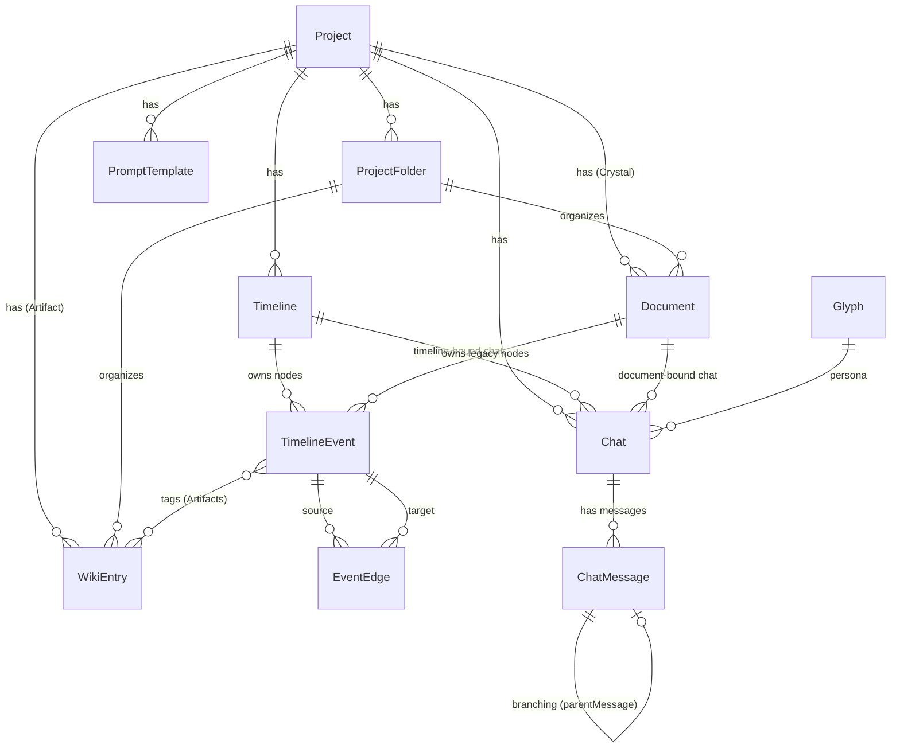

# Rhyolite_OS

**Rhyolite_OS** is a terminal-style creative + research environment for long-form fiction writers, world-builders, and technical researchers. It replaces the traditional "smart typewriter" UI with a high-contrast, data-dense hacking interface designed for managing complex, multi-threaded narratives and reasoning chains alongside multi-provider LLMs (Gemini, OpenAI-compatible, Anthropic).

## System Architecture & Features

- **Immersive Terminal Interface:**
  - **Uplink Aesthetics:** High-contrast ultraviolet color scheme, CRT phosphor glows, Monaspace Neon (with coding ligatures), and flat bordered panes instead of glass/card UI.
  - **Tactical Overlay:** Live mouse-tracking crosshairs, blocky scrollbars, and a top bar **Project_Index** strip (`DOCS` / `ARTS` / `TLNS` counts + `[ GLOBAL_NETWORK ]` button).
  - **Keyboard Shortcuts:** `Cmd+K` command palette (full-text search across all content), `Cmd+1` focus editor, `Cmd+2` focus chat.
  - **3-Pane OS Layout:**
    - `[DIR]` **Project Directory (Left):** `CRYSTAL_DB` (chapters) with per-folder `[EXP]` export, `ARTIFACTS` (wiki), `**TIMELINES`** (standalone DAG canvases), folders with drag-and-drop reordering. **System** section at bottom: Project Settings, Manage Glyphs, Export Manuscript.
    - `[EDIT]` **Editor (Center):** Markdown editor with live side-by-side preview. Debounced rendering for large documents. Entity link hover previews. AI diff highlighting (green flash on appended content). Auto entity link suggestions.
    - `[COMMS]` **Assistant (Right):** Streaming chat with branch navigation, compact token budget (`CTX: ~20.6k` with full breakdown on hover), `**[+ DOC]`** append, **Edit/Del** on user messages, **Del** on AI messages, saved prompt templates (`/`), and safety presets.
- **Global Network Map (top bar, `d3-force` + `reactflow`):**
  - Organic physics-based layout of all Crystals, Artifacts, and Timeline events.
  - **Click a node** -> preview drawer with content and `OPEN` button.
  - **Click empty space** -> deselect.
  - **Edge types:** Content links (pink), Timeline DAG (violet), Event references (amber), Event tags (teal).
- **Directed Acyclic Graph (DAG) Timeline Canvas (`reactflow`):**
  - **First-class timelines:** Create timelines under `:: TIMELINES`; each has its own node/edge store.
  - **Interaction:** Double-click canvas to create nodes. Connect handles for **Semantic Edges**. Click an edge to label its relationship. Backspace/Delete removes selected elements. Grid snapping.
  - **DAG Templates:** Apply predefined narrative or technical node/edge structures from the `[ TEMPLATE ]` button.
  - **Node Editor:**
    - **Categorical Types:** Narrative (Event, Scene, Lore) or Technical (Hypothesis, Evidence, Conclusion).
    - **Context Control:** `[x] INJECT FULL CONTENT DOWNSTREAM` for upstream RAG.
    - **Auto-Synthesis:** `[ AUTO_SYNTHESIZE ]` reads up to 10 hops upstream and generates content/summary via LLM. Export to Artifact or Crystal.
- **Advanced Context Engine (Hybrid RAG + Graph Traversal):**
  - **Core Canon:** `loreBible` + `storyOutline` in system instruction.
  - **Keyword RAG:** Title/alias substring matching against recent turns and active document tail.
  - **Embedding RAG:** Semantic search via Gemini `text-embedding-004` vectors stored in `embeddings.json`. Combined with keyword results for best coverage.
  - **Graph Traversal RAG:** BFS backward through edges (depth 10) from focused node. Full content for active node, summaries for ancestors, edge semantics included.
  - **Smart Context Windowing:** For large documents (>800 words), sends start + cursor region + end chunks instead of full content.
  - **Token Budget Visualization:** Real-time breakdown (Canon, Wiki, DAG, Draft, History) streamed as `__meta` frame. Compact display with hover tooltip.
  - **Chat binding:** Chat tied to chapter (`documentId`) or timeline (`timelineId`).
- **Multi-Model Support:**
  - **Providers:** Gemini (`@google/genai`), OpenAI-compatible (local models via `OPENAI_BASE_URL`), Anthropic (`ANTHROPIC_API_KEY`).
  - Each **Glyph** (persona) specifies its provider, model, temperature, max tokens, and system instructions.
- **Tactical Writing Tools:** Infill on selections, extract to wiki, `[+ DOC]` append, auto entity link suggestions, manuscript export (full project or per-folder).
- **Markdown Conveniences:**
  - `[[Title]]`, `[Title]`, and `[Title](<TitleOrId>)` resolve as internal Crystal/Artifact links with hover previews.
  - `> [!quote] ...` renders as a styled callout, hiding the `[!quote]` marker.
- **Version History:** Automatic snapshots of Crystals and Artifacts on save, stored in `.history/` directories. Browse via `/api/history`.
- **Full-Text Search:** `Cmd+K` command palette searches all documents, wiki entries, and timeline events with ranked snippets.
- **Saved Prompt Templates:** Per-project reusable prompts with the `/` menu in chat. Save current input as template.
- **Indexed Lookups:** Centralized `entity-index.json` for O(1) entity-to-project resolution, self-healing on cache miss.

## Setup & Initialization

### Prerequisites

- Node.js (v18+ recommended)
- A Google Gemini API Key (required). Optionally: `OPENAI_BASE_URL` + `OPENAI_API_KEY` for local models, `ANTHROPIC_API_KEY` for Claude.

### Boot Sequence

1. Clone the repository.
2. `npm install`
3. Create `.env` with `GEMINI_API_KEY` (see `.env.example`). Optionally set `WORKSPACE_DIR` to a folder where project data should live (defaults to `.workspace` under the repo).
4. `npm run dev` -> open the app (e.g. `http://localhost:3000`).

**Data storage:** Projects are stored on disk as plain files -- no database. Each project is a directory under the workspace (`project.json`, `folders.json`, `crystals/*.md`, `artifacts/*.md`, `timelines/*.json`, `chats/*.json`, `embeddings.json`). Workspace-level `glyphs.json` holds personas, `entity-index.json` holds the lookup cache.

## How to Use the DAG & Comms (End-to-End)

1. **Create a timeline:** In `[DIR]`, under `:: TIMELINES`, use `[+TLN]`. Open it -- the center pane is the DAG.
2. **Initialize comms for that timeline:** In `[COMMS]`, pick a Glyph and `[ INITIALIZE_UPLINK ]` (one chat per timeline, stored with `timelineId`).
3. **Build the graph:** Double-click the pane background or click `[ + NODE ]`. Set its **Node Type** (e.g., `Hypothesis`, `Scene`). Or use `[ TEMPLATE ]` to apply a predefined structure.
4. **Link nodes semantically:** Connect bottom -> top handles. **Click the newly created edge** to label the relationship (e.g., "Requires", "Refutes").
5. **Link crystals & artifacts:** Drag a chapter or wiki row from the sidebar onto the canvas; the new node carries `[DOC]` or `[ART]` and a reference id.
6. **Synthesize or Prompt:**
  - Click a downstream node and press `**[ AUTO_SYNTHESIZE ]`** to let the engine evaluate all upstream evidence and write the conclusion.
  - OR, prompt manually in comms. Keyword + embedding wiki pull uses your recent messages. DAG context uses the **selected** node, its upstream chain, and all edge semantics.
7. **Append prose:** `[+ DOC]` appends to the **open chapter** if you are in a document context, or to the **chapter linked on the focused node** (`referenceType === "document"`) when working from a timeline.

**Referencing lore in chat:** There is no `@crystal` syntax. The model sees artifacts whose **titles/aliases** appear as plain substrings in the recent user text and optional chapter tail, plus semantically similar entries via embedding search. Name things consistently or add aliases in artifact metadata.

## Global Network Map (d3-force + reactflow)

Open it from the **top bar** (`[ GLOBAL_NETWORK ]`).

- **Click a node** to open the preview drawer (contents/data + an `OPEN` button).
- **Click empty space** to deselect.
- **Open button** behavior:
  - `DOC` nodes open the Crystal chapter.
  - `ART` nodes open the Artifact.
  - `EVT` nodes open the containing Timeline and selects that event node.
- **How relationships are drawn (edges):**
  - **Content links** (pink): Scans every Crystal and Artifact body for `[Title]` or `[[Title]]` bracket references. When a title matches another Crystal, Artifact, or alias (case-insensitive), a link edge is created.
  - **Timeline DAG** (violet): Edges between event nodes (`EventEdge` label, if present).
  - **Event references** (amber): `referenceType/referenceId` -> event references a Crystal/Artifact.
  - **Event tags** (teal): `tags[]` -> event is connected to tagged Artifacts.

### Node Configuration & Context

| Property                | Role                                                                                                         |
| ----------------------- | ------------------------------------------------------------------------------------------------------------ |
| **Node Type**           | Categorizes the node visually and structurally in the prompt (e.g., `[Hypothesis]`, `[Scene]`).              |
| **Content**             | Full scene text, data, or notes. Always injected in full when the node is focused.                           |
| **Summary**             | Short recap used for downstream RAG (saves tokens).                                                          |
| **Full Content Toggle** | Bypasses the summary and injects the upstream node's **Content** block into the context of downstream nodes. |
| **Edge Labels**         | Defines the logical link between nodes. Injected as `[Node A] --(Contradicts)--> [Node B]`.                  |

### Complex Reasoning via DAG

By structuring your prompts using **typed nodes** and **labeled edges**, you can force the LLM to follow specific chronological or logical reasoning paths.

- Map out cause-and-effect or technical derivations over multiple nodes.
- Label edges to define exactly how pieces of information interact (e.g., `"Code Snippet A" --(Implements)--> "Hypothesis B"`).
- Use the `**[ AUTO_SYNTHESIZE ]`** button on a terminal node to automatically traverse up to **10 hops** of upstream dependencies, evaluate the evidence, and generate a synthesized conclusion directly into the node's content.

## Tech Stack

- **Core:** Next.js (App Router), React 19
- **Persistence:** Local filesystem (`src/lib/fs-db.ts`) -- Markdown with YAML frontmatter (`gray-matter`) for crystals/artifacts, JSON for timelines, chats, and config
- **AI:** Multi-provider via `src/lib/providers.ts` (Gemini, OpenAI-compatible, Anthropic). Embeddings via Gemini `text-embedding-004`.
- **Canvas:** `reactflow` (v11), `d3-force` for the global network map
- **Styling:** Tailwind CSS, custom CRT/crosshair layers
- **Markdown:** `react-markdown`, `remark-gfm`

## Logical Entity Model (on-disk layout)

The following diagram illustrates how concepts map to files and folders (not a SQL schema).

## Full Program Graph (flow, data, systems)

```mermaid
graph TB
  subgraph UI [UI Layer]
    direction LR
    SB["ProjectSidebar<br/>Folders + Drag/Drop + Per-folder Export"]
    NAV["WorkspaceClient<br/>Navigation + State + Hotkeys"]
    EDIT["DocumentEditorPane<br/>Markdown Editor + Preview<br/>+ Debounce + AI Diff + Entity Suggestions"]
    WIKI["WikiMarkdown<br/>Callouts + Internal Links + Hover Preview"]
    DAG["TimelineCanvas<br/>reactflow DAG + Templates"]
    COMMS["ChatThread<br/>Streaming + Branching<br/>+ Token Budget + Prompt Templates"]
    MAP["GlobalMapCanvas<br/>reactflow + d3-force"]
    CMD["CommandPalette<br/>Full-text Search"]
  end

  subgraph APIS [API Routes]
    direction LR
    NET_API["/api/projects/:id/network"]
    TL_API["/api/timeline?scope"]
    NODE_API["/api/timeline/nodes/:id"]
    SYNTH_API["/api/timeline/nodes/:id/synthesize"]
    TPL_API["/api/timeline/templates"]
    CHAT_API["/api/chat - streaming"]
    REGEN_API["/api/chat/regenerate"]
    DEL_API["/api/chats/:id/messages/:id DELETE"]
    DOC_API["/api/documents/:id"]
    WIKI_API["/api/wiki/:id"]
    SEARCH_API["/api/search"]
    HIST_API["/api/history"]
    ENT_API["/api/entities/suggest"]
    PROV_API["/api/providers"]
    PROMPT_API["/api/prompts"]
    EXPORT_API["/api/projects/:id/export"]
  end

  subgraph RAG [RAG + LLM Engine]
    direction LR
    DAGCTX["DAG Traversal<br/>BFS <=10 hops"]
    LEXRAG["Wiki Title/Alias<br/>Keyword Match"]
    EMBRAG["Embedding RAG<br/>text-embedding-004"]
    CANON["Core Canon<br/>loreBible + storyOutline"]
    DRAFT["Smart Context Windowing<br/>Cursor-based chunking"]
    STREAM["Multi-Provider Streaming<br/>Gemini / OpenAI / Anthropic"]
  end

  subgraph FS [Filesystem Persistence]
    direction LR
    PROJ["project.json<br/>folders.json"]
    CRYS["crystals/*.md<br/>+ .history/"]
    ARTS["artifacts/*.md<br/>+ .history/"]
    TLNS["timelines/*.json"]
    CHATS["chats/*.json"]
    GLYPHS["glyphs.json"]
    IDX["entity-index.json"]
    EMBS["embeddings.json"]
  end

  %% UI navigation
  SB -->|"navigate"| NAV
  NAV --> EDIT
  NAV --> DAG
  NAV --> COMMS
  NAV -->|"GLOBAL_NETWORK"| MAP
  NAV -->|"Cmd+K"| CMD

  %% Editor internals
  EDIT --> WIKI
  EDIT -->|"entity suggestions"| ENT_API
  DAG -->|"focus node"| NODE_API
  DAG -->|"apply template"| TPL_API

  %% Map flow
  MAP --> NET_API

  %% Search
  CMD --> SEARCH_API

  %% Network API: content link scanning
  NET_API -->|"scan bracket links"| CRYS
  NET_API -->|"scan bracket links"| ARTS
  NET_API -->|"DAG edges + refs"| TLNS

  %% API to Persistence
  TL_API --> TLNS
  NODE_API --> TLNS
  SYNTH_API --> TLNS
  CHAT_API --> CHATS
  REGEN_API --> CHATS
  DEL_API --> CHATS
  DOC_API --> CRYS
  WIKI_API --> ARTS
  EXPORT_API --> CRYS
  HIST_API --> CRYS
  HIST_API --> ARTS

  %% RAG assembly
  NODE_API -->|"activeTimelineEventId"| DAGCTX
  DAGCTX -->|"upstream context"| CHAT_API
  LEXRAG -->|"matched artifacts"| CHAT_API
  EMBRAG -->|"similar entries"| CHAT_API
  CANON -->|"system instruction"| CHAT_API
  DRAFT -->|"windowed draft"| CHAT_API
  CHAT_API --> STREAM
  SYNTH_API --> STREAM

  %% Comms actions
  COMMS -->|"+DOC append"| DOC_API
  COMMS -->|"delete msg"| DEL_API
  COMMS -->|"regenerate"| REGEN_API
  COMMS -->|"prompt templates"| PROMPT_API

  %% DAG canvas
  DAG --> TL_API
  DAG -->|"auto-synthesize"| SYNTH_API
  SB -->|"drag crystal/artifact"| DAG
```

## Workflow Directives

1. Create/select a **project**.
2. Set **Core Canon** and outline in **Project Settings**.
3. Fill **ARTIFACTS** with entities (titles + aliases help both keyword and embedding RAG).
4. Add **TIMELINES** for plot DAGs or reasoning chains. Use `**[ TEMPLATE ]`** for quick scaffolding.
5. Bind **Comms** (glyph) to the chapter or timeline you are working in.
6. **Focus** the node you want the model to "be at", then prompt; use **Edit** / **Del** on user lines to fix or prune branches.
7. Use `**Cmd+K`** to search across all project content. Hover entity links for quick previews. Export manuscripts from the System menu or per-folder `[EXP]` buttons.

## License

Copyright (c) 2026 [7368697661](https://github.com/7368697661). Rhyolite_OS is licensed under the [Business Source License 1.1](LICENSE) (BSL 1.1).

**Summary:** You may use, modify, and share the software for personal, hobby, academic, and other non-production use. **Production Purpose** — broadly, monetizing it as a service or product, or mandating it inside a for-profit company for core commercial operations — requires a commercial license from the Licensor. See [LICENSE](LICENSE) for the full terms and the detailed Production Purpose section.