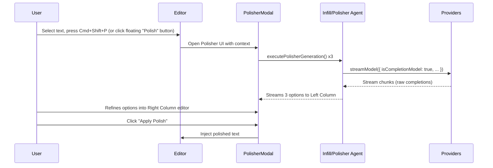

# Implement "The Polisher" (Llama 3.1 & Multi-Generation Refining)

We will implement the required architecture to support non-chat models (like Llama 3.1 405B) and introduce a new **The Polisher** UI in the editor. This UI allows the user to generate multiple variations of text (forward continuation or retroactive rewrite) and manually "refine" them together, separate from the basic inline infill tool.

## Terminology / Theme

- **Feature Name**: "The Polisher". In stoneworking, polishing is the final, meticulous step of smoothing out the rough edges and revealing the final texture, which perfectly fits this manual, multi-generation editing process.
- **Action**: "Refine" or "Polish" 
- **Flag**: `isPolisherEngine` (to clarify this is for the multi-gen editor, while basic infill might use a faster chat model).

## Proposed Changes

1. **Rust Backend (`src-tauri/src/fs_db.rs`)**
   - Update the `FsGlyph` struct to include `is_completion_model: Option<bool>` and `is_polisher_engine: Option<bool>`.
   - Use `#[serde(skip_serializing_if = "Option::is_none")]` to preserve existing configurations.

2. **Types & State (`src/lib/agents/fs-db.ts`, `src/lib/state.svelte.ts`)**
   - Add `isCompletionModel?: boolean` and `isPolisherEngine?: boolean` to `FsGlyph` and `Glyph` definitions.

3. **Glyph UI Configuration (`src/lib/components/Glyphs.svelte`)**
   - Add toggle: **Completion Engine (Raw Prompt Format)** (`isCompletionModel`). Instructs the backend to use raw text endpoints (`/completions`) instead of chat completions.
   - Add toggle: **Polisher Engine** (`isPolisherEngine`). Marks this Glyph as the default generator for The Polisher UI.

4. **Stream Model Implementation (`src/lib/agents/providers.ts`)**
   - Update `getEnv` to use Tauri's async `invoke('get_config', { key })` instead of synchronous `process.env`.
   - Update `StreamModelParams` to accept `isCompletionModel?: boolean`.
   - In `streamOpenAI`, if `isCompletionModel` is true:
     - Set endpoint to `${baseUrl}/completions`.
     - Flatten `messages` and `systemInstruction` into a single `prompt` string format.
     - Extract text from `parsed.choices?.[0]?.text` instead of `delta.content`.

5. **Infill Agent (`src/lib/agents/infill.ts`)**
   - Keep existing `executeInfill` for the basic inline replacement.
   - Create a new exported function `executePolisherGeneration` which explicitly fetches the Glyph marked `isPolisherEngine: true`.
   - Setup the prompt to handle forward-generation (if no text selected, passing trailing context) or rewriting (if text selected).

6. **The Polisher UI (`src/lib/components/PolisherModal.svelte`)**
   - A floating Svelte modal (similar to DocsModal).
   - **Left Column**: Displays 3 distinct generation cards streaming in parallel (the "facets" or "iterations").
   - **Right Column**: A "Polishing Wheel" text editor area where the user can mix, match, and type.
   - Actions: "Generate More", "Apply Polish", "Cancel".

7. **Editor Integration (`src/lib/components/Editor.svelte`)**
   - **Floating Menu**: When text is selected, show a small floating action bar with "✨ Infill" (basic) and "💎 Polish" (multi-gen).
   - **Keyboard Command**: e.g., `Cmd+Shift+P` or `Cmd+J` to open The Polisher UI based on the current cursor position/selection.
   - Inject the final "polished" text back into the editor seamlessly.

8. **Documentation Updates**
   - Add a section in `DocsModal.svelte` and `README.md` explaining the difference between Basic Infill (quick replacements) and The Polisher (multi-generation refining, ideal for non-chat completion models like Llama 3.1 405B).

## Architecture Flow

