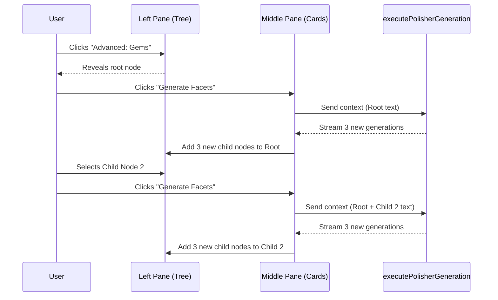

# Advanced "Gems" Mode for The Polisher

This plan outlines the architecture for adding a branching narrative tree to The Polisher. This allows writers to explore multiple narrative paths ("Gems") recursively, generating and managing variations before weaving them into the final text.

## Core Concepts & Terminology

- **The Polisher**: The overall 3-pane modal UI for text generation and refinement.
- **Gems Mode**: The advanced, collapsible left-hand pane containing the branching tree.
- **Node/Gem**: A single unit of generated text in the tree. The root node is the original prompt/context. Child nodes are subsequent generations branching from their parent.
- **Facet**: One of the 3 parallel generations produced from a node.

## 1. Data Structure

We need a recursive structure to track the branching paths. This should be managed in the frontend state (within `PolisherModal.svelte` or a dedicated `.svelte.ts` store if it gets complex).

```typescript
type GemNode = {
  id: string;
  parentId: string | null;
  text: string;
  children: GemNode[];
};
```

## 2. UI Architecture (The 3 Panes)

The `PolisherModal` will transition from a 2-pane to a dynamic 3-pane layout.

### Pane 1: The Gems Tree (Left, Collapsible)
- **Visibility**: Hidden by default. Toggled via an `[ Advanced: Gems ]` button.
- **Component**: A new recursive Svelte component (`PolisherTree.svelte`).
- **Functionality**:
  - Displays nodes hierarchically.
  - Shows truncated text (`node.text.slice(0, 40) + '...'`) for readability.
  - **Selection**: Clicking a node sets it as the `activeNodeId`.
  - **Zooming**: Clicking a "Focus" icon on a node sets it as the `rootViewId`, hiding its ancestors to reduce visual clutter. A "Zoom Out" button appears at the top to revert to the parent.

### Pane 2: The Facets (Middle)
- **State Tied to Tree**: This pane always reflects the children of the `activeNodeId`.
- **Display**: If the active node has children, it displays them as cards (up to 3 at a time, or scrollable if the user generated multiple batches). If the active node is currently generating, it shows the live streaming cards.
- **Action**: "Generate Facets". Clicking this takes the *cumulative text* (from the root down to the `activeNodeId`) and requests 3 new generations from the LLM. When complete, these 3 generations are added as child nodes to the `activeNodeId`.

### Pane 3: The Polishing Wheel (Right)
- **Functionality**: Remains unchanged. The user clicks `[ Use ]` on any facet in the Middle Pane, which copies its text into this manual editor textarea.
- **Action**: "Apply Polish" injects the content of the Polishing Wheel back into the main document editor.

## 3. Context Management (LLM Prompting)

When the user selects a node deep in the tree and clicks "Generate Facets", the LLM needs the full context of that specific branch.

**The Context Resolution Algorithm:**
1. Traverse upward from the `activeNodeId` to the root node.
2. Concatenate the text of all nodes in that path in chronological order.
3. Append this "branch history" to the base prompt (which includes the surrounding document context, Lore Bible, etc.).

*Example*: If Root says "The hero enters." -> Child A says "He draws his sword." -> Child A1 says "It glows blue.", generating from A1 sends: `"The hero enters. He draws his sword. It glows blue."` as the immediate context to continue from.

## Architecture Flow



## Implementation Steps

1. **State Definition**: Define the `GemNode` type and instantiate the tree state in `PolisherModal.svelte` with a root node representing the initial empty generation state.
2. **Recursive Tree Component**: Build `PolisherTree.svelte` to render the nodes, handle selection (`activeNodeId`), and handle focusing (`rootViewId`).
3. **Context Builder**: Write a helper function in `PolisherModal.svelte` that traverses from an ID to the root to build the cumulative string.
4. **Update Generation Logic**: Modify the `generate` function to pass the cumulative string to `executePolisherGeneration` and, upon completion, push the new `GemNode`s into the active node's `children` array.
5. **Layout Adjustments**: Add the collapsible left sidebar layout using Tailwind CSS grid or flex layouts with transition animations.